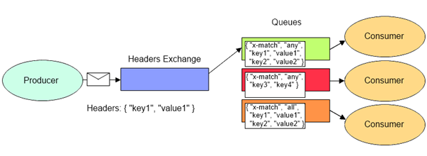

### 使用的好处

1. 对于高并发场景下，利用消息队列可以使得**并行变为串行**达到一定量的限流
2. 解耦、异步、削峰、负载均衡

### 核心概念

#### Connection（连接）

​	每个producer（生产者）或者consumer（消费者）要通过RabbitMQ发送与消费消息，首先就要与RabbitMQ建立连接，这个连接就是Connection。Connection是一个TCP长连接

#### Channel（信道）

​	Channel是在Connection的基础上建立的虚拟连接，RabbitMQ中大部分的操作都是使用Channel完成的，比如：声明Queue、声明Exchange、发布消息、消费消息等。

​	看到此处，你是否有这样一个疑问：既然已经有了Connection，我们完全可以使用Connection完成Channel的工作，为什么还要引入Channel这样一个虚拟连接的概念呢？因为现在的程序都是支持多线程的，如果没有Channel，那么**每个线程在访问RabbitMQ时都要建立一个Connection这样的TCP连接，对于操作系统来说，建立和销毁TCP连接是非常大的开销，在系统访问流量高峰时，会严重影响系统性能。**

​	Channel就是为了解决这种问题，通常情况下，每个线程创建单独的Channel进行通讯，每个Channel都有自己的channel id帮助Broker和客户端识别Channel，所以Channel之间是完全隔离的。

​	Connection与Channel之间的关系可以比作光纤电缆，如果把Connection比作一条光纤电缆，那么Channel就相当于是电缆中的一束光纤。

#### Queue（队列）

​	Queue是一个用来存放消息的队列，生产者发送的消息会被放到Queue中，消费者消费消息时也是从Queue中取走消息

#### Virtual host（虚拟主机）

​	Virtual host是一个虚拟主机的概念，一个Broker中可以有多个Virtual host，每个Virtual host都有一套自己的Exchange和Queue，同一个Virtual host中的Exchange和Queue不能重名，不同的Virtual host中的Exchange和Queue名字可以一样。这样，不同的用户在访问同一个RabbitMQ Broker时，可以创建自己单独的Virtual host，然后在自己的Virtual host中创建Exchange和Queue，很好地做到了**不同用户之间相互隔离的效果**。

#### Exchange（交换机）

​	Exchange是一个比较重要的概念，它是消息到达RabbitMQ的第一站，**主要负责根据不同的分发规则将消息分发到不同的Queue，供订阅了相关Queue的消费者消费到指定的消息**。那Exchange有哪些分发消息的规则呢？这就要说到Exchange的4种类型了：**direct**、**fanout**、**topic**、**headers**。

##### Routing key

​	当我们创建好Exchange和Queue之后，需要使用**Routing key（通常叫作Binding key）**将它们绑定起来，producer在向Exchange发送一条消息的时候，必须指定一个Routing key，然后Exchange接收到这条消息之后，会解析Routing key，然后根据Exchange和Queue的绑定规则，将消息分发到符合规则的Queue中。

##### direct

​	direct的意思是直接的，direct类型的Exchange会将消息转发到指定Routing key的Queue上，Routing key的解析规则为精确匹配。也就是只有当producer发送的消息的Routing key与某个Binding key相等时，消息才会被分发到对应的Queue上。

##### fanout

​	fanout是扇形的意思，该类型通常叫作**广播类型**。fanout类型的Exchange不处理Routing key，而是会将发送给它的消息路由到所有与它绑定的Queue上

##### **topic**

​	topic类型的Exchange会根据通配符对Routing key进行匹配，只要Routing key满足某个通配符的条件，就会被路由到对应的Queue上。通配符的匹配规则如下：

- Routing key必须是一串字符串，每个单词用“.”分隔；
- 符号“#”表示匹配一个或多个单词；
- 符号“*”表示匹配一个单词。

​	例如：“*.123” 能够匹配到 “abc.123”，但匹配不到 “abc.def.123”；“#.123” 既能够匹配到 “abc.123”，也能匹配到 “abc.def.123”。

**headers**

​	headers Exchange中，Exchange与Queue之间的绑定不再通过Binding key绑定，而是通过Arguments绑定。

​	producer在发送消息时可以添加headers属性，Exchange接收到消息后，会解析headers属性，只要我们上面配置的Arguments中的所有属性全部被包含在Headers中并且值相等，那么这条消息就会被路由到对应的Queue中。

### 死信队列（DLX-Dead Letter Exchange）

​	死信，顾名思义就是无法被消费的消息。一般来说，producer将消息投递到broker或者直接到queue里了，consumer从queue取出消息进行消费，但某些时候由于特定的原因导致queue中的某些消息无法被消费，这样的消息如果没有后续的处理，就变成了死信，**接收死信消息的队列就叫死信队列**

​	**死信交换机本质上就是一个普通的交换机，只是因为队列设置了参数指定了死信交换机，这个普通的交换机才成为了死信的接收者**

#### 成为死信的条件

- 消息的TTL到了，消息过期了仍然没有被消费
- 消息被consumer拒收了，并且拒收方法的requeue参数是false，也就是说不会重新入队被其他消费者消费
- 队列的长度限制满了，排在前面的消息会被丢弃或者进入死信路由

### 延时队列

队列中的消息希望在一定时间后再被处理，其使用场景举例如下：

- 订单在10分钟之内未支付则自动取消
- 拍卖成功后进入公示状态，公示10分钟后取消公示状态
- 用户注册成功后，如果超过24小时没有登录则进行短信提醒

#### 利用死信队列实现延时队列

一个普通的交换机发送具有延时功能的消息，该交换机将这些消息放到一个特殊的队列，这个队列做了如下设置：

- 指定了队列中**消息的TTL**
- 指定了消息超时成为死信之后，要将死信交给哪个交换机
- 指定了将死信交给指定交换机后，交换机用什么路由键将这些死信发送给指定的死信队列

最终从指定的死信队列中取出的消息就是延时消息了

缺陷：

- 如果采用在消息属性上设置TTL而非使用队列TTL的方式，消息可能并不会按时死亡，因为RabbitMQ只会检查第1个消息是否过期，如果过期则丢到死信队列，如果第1个消息的延时时长很长，而第2个消息的延时时长很短，第2个消息并不会优先得到执行

- 需要创建1个普通队列加1个对应的死信队列，创建的队列过多

### 优先级队列

​	优先级高的消息具备优先被消费的特权，可选队列参数**x-max-priority**声明的优先级队列

### 消息过期时间(TTL)

消息过期时间（TTL）下面两种方式进行设置

1. 通过队列属性设置，队列中所有消息都有相同的过期时间。
2. 对每条消息单独设置过期时间，每条消息的TTL可以不同。如果两种方法一起使用，则消息的TTL以两者之间较小的那个数值为准。

​	**对于第一种设置队列属性的方法，一旦消息过期，就会从队列中抹去，而在第二种方法中，即使消息过期，也不会马上从队列中删除，因为每条消息是否过期是在消息投递到消费者之前才进行检查**。

### 持久化

​	RabbitMQ持久化机制分为**队列持久化**、**消息持久化**、**交换器持久化**。不管是持久化的消息还是非持久化的消息都可以被写入到磁盘。

​	持久化消息会同时写入磁盘和内存（加快读取速度），非持久化消息会在内存不够用时，将消息写入磁盘（Rabbitmq重启之后就没有了）。

### 消息确认机制

#### confirm 模式

##### 生产者

​	生产者将信道设置成confirm模式，一旦信道进入confirm模式，所有在该信道上面发布的消息都将会被指派一个唯一的ID(从1开始)，一旦消息被投递到所有匹配的队列之后，broker就会发送一个确认给生产者(包含消息的唯一ID)，这就使得生产者知道消息已经正确到达目的队列了，如果消息和队列是可持久化的，那么确认消息会在将消息写入磁盘之后发出，broker回传给生产者的确认消息中delivery-tag域包含了确认消息的序列号，此外broker也可以设置basic.ack的multiple域，表示到这个序列号之前的所有消息都已经得到了处理；

​    confirm模式最大的好处在于他是异步的，一旦发布一条消息，生产者应用程序就可以在等信道返回确认的同时继续发送下一条消息，当消息最终得到确认之后，生产者应用便可以通过回调方法来处理该确认消息，如果RabbitMQ因为自身内部错误导致消息丢失，就会发送一条nack消息，生产者应用程序同样可以在回调方法中处理该nack消息；

##### 消费者

​	为了保证消息从队列可靠地到达消费者，RabbitMQ提供消息确认机制(message acknowledgment)。消费者在声明队列时，可以指定noAck参数，当noAck=false时，RabbitMQ会等待消费者显式发回ack信号后才从内存(和磁盘，如果是持久化消息的话)中移去消息。否则，RabbitMQ会在队列中消息被消费后立即删除它。

#### 事务机制

开启事务，只有消息成功被 broker 接受，事务提交才能成功，否则进行回滚。
