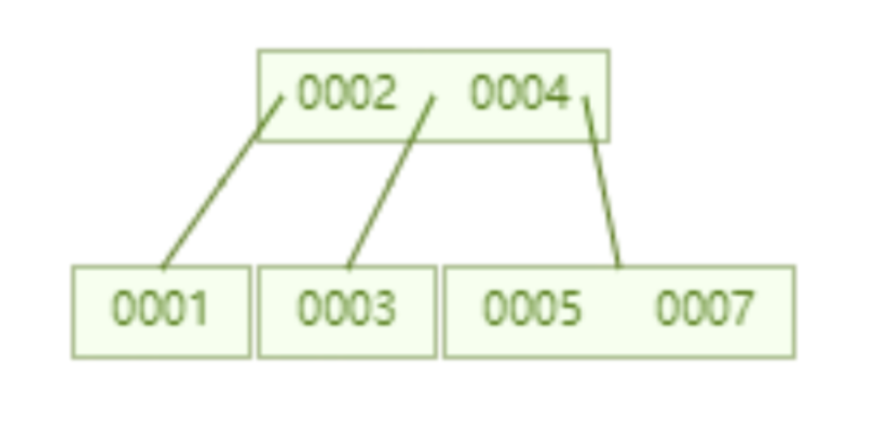
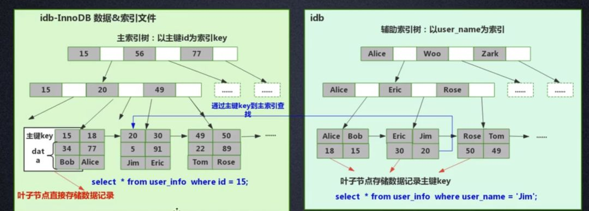
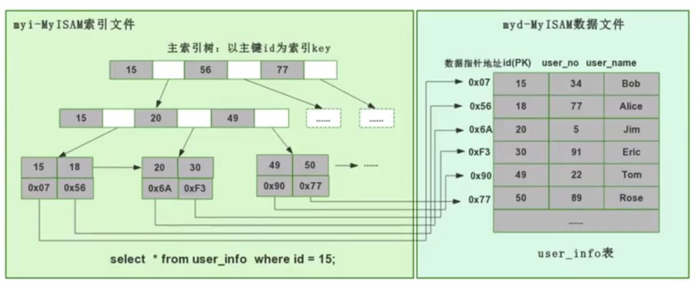

https://blog.csdn.net/u013066244/article/details/114241352
https://www.cnblogs.com/zhenren001/p/15895222.html  
&ensp;&ensp;索引的作用是做数据的快速检索，而快速检索的实现的本质是数据结构。通过不同数据结构的选择，实现各种数据快速检索。
在数据库中，高效的查找算法是非常重要的，
因为数据库中存储了大量数据，一个高效的索引能节省巨大的时间
### 索引底层数据结构选型
1. 哈希表(hash)  
&ensp;&ensp;从算法时间复杂度分析来看，哈希算法时间复杂度为 O（1），检索速度非常快。但是在数据的范围查找来看，如果使用哈希算法实现的索引，
要做范围查找的话，一个简单的思路就是一次把所有数据找出来加载到内存，然后再在内存里筛选筛选目标范围内的数据。
但是这个范围查找的方法十分太笨重了，没有一点效率而言。
所以，使用哈希算法实现的索引虽然可以做到快速检索数据，但是没办法做数据高效范围查找，
因此哈希索引是不适合作为 Mysql 的底层索引的数据结构。

2. 二叉查找树(BST)  
&ensp;&ensp;二叉查找树的时间复杂度是 O(lgn)，但普通的二叉查找树有个致命缺点：极端情况下会退化为线性链表，这时二叉树已经极度不平衡，二分查找也会退化为遍历查找，
时间复杂退化为 O（N），检索性能急剧下降。  
&ensp;&ensp;在数据库中，数据的自增是一个很常见的形式，比如一个表的主键是 id，而主键一般默认都是自增的，如果采取二叉树这种数据结构作为索引，
那上面介绍到的不平衡状态导致的线性查找的问题必然出现。
因此，简单的二叉查找树存在不平衡导致的检索性能降低的问题，是不能直接用于实现 Mysql 底层索引的。

3. AVL树和红黑树

&ensp;&ensp;二叉查找树存在不平衡问题可以通过树节点的自动旋转和调整，让二叉树始终保持基本平衡的状态。那么基于这种思路的二叉树有AVL树和红黑树。但是
红黑树会出现“右倾”趋势，但这个趋势远没有二叉查找树退化为线性链表那么夸张，不过这对于查找性能而言也是巨大的消耗。  
&ensp;&ensp;AVL 树是个绝对平衡的二叉树，因此他在调整二叉树的形态上消耗的性能会更多，同时不存在红黑树的“右倾”问题。也就是说，大量的顺序插入不会导致查询性能的降低。
但是 AVL 树并不适合做 Mysql 数据库的索引数据结构，因为数据库查询数据的瓶颈在于磁盘 IO，如果使用的是 AVL 树，
每一个树节点只存储了一个数据，我们一次磁盘 IO 只能取出来一个节点上的数据加载到内存里，如果要取树节点的值，那么就需要进行多少磁盘 IO，
这就十分耗费时间。所以设计数据库索引时需要首先考虑怎么尽可能减少磁盘 IO 的次数的同时， 尽可能的多取数据。

4. B 树  
&ensp;&ensp;B 树，每个节点限制最多存储两个 key，一个节点如果超过两个 key 就会自动分裂。比如下面这个存储了 7 个数据 B 树，
只需要查询两个节点就可以知道 id=7 这数据的具体位置，也就是两次磁盘 IO 就可以查询到指定数据，优于 AVL 树。

优点
   - 检索速度快，时间复杂度：B 树的查找性能等于 O（h*logn），其中 h 为树高，n 为每个节点关键词的个数
   - 尽可能少的磁盘 IO，加快了检索速度
   - 可以支持范围查找

5. B+树  
+ B 树一个节点里存的是数据，而 B+树存储的是索引（地址），所以 B 树里一个节点存不了很多个数据，但是 B+树一个节点能存很多索引，B+树叶子节点存所有的数据
+ B+树的叶子节点是数据阶段用了一个链表串联起来，便于范围查找

### Innodb 引擎和 Myisam 引擎的实现
#### Innodb 引擎底层实现（聚集索引方式）
&ensp;&ensp;InnoDB 是聚集索引方式，因此数据和索引都存储在同一个文件里

#### MyISAM 引擎底层实现（非聚集索引方式）
&ensp;&ensp;MyISAM 用的是非聚集索引方式，即数据和索引落在不同的两个文件上。MyISAM 在建表时以主键作为 KEY 来建立主索引 B+树，
树的叶子节点存的是对应数据的物理地址。拿到这个物理地址后，就可以到 MyISAM 数据文件中直接定位到具体的数据记录了。

当为某个字段添加索引时，我们同样会生成对应字段的索引树，该字段的索引树的叶子节点同样是记录了对应数据的物理地址，
然后也是拿着这个物理地址去数据文件里定位到具体的数据记录