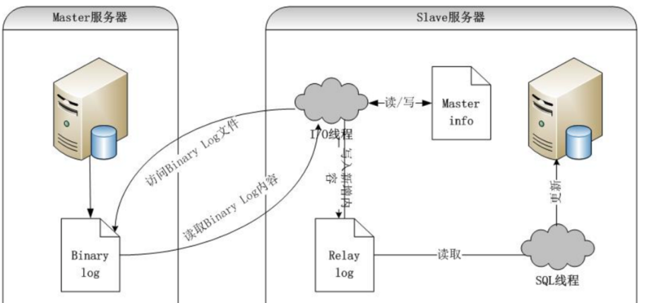

## 过程
1. master 主库将此次更新的事件类型写入到主库的 binlog 文件中 
2. master 创建 log dump 线程通知 slave 需要更新数据 
3. slave 向 master 节点发送请求，将该 binlog 文件内容存到本地的 relaylog 中 
4. slave 开启 sql 线程读取 relaylog 中的内容，将其中的内容在本地重新执行一遍，完成主从数据同步

## 同步策略
1. 全同步复制：主库强制同步日志到从库，等全部从库执行完才返回客户端，性能差
2. 半同步复制：主库收到至少一个从库确认就认为操作成功，从库写入日志成功返回ack确认