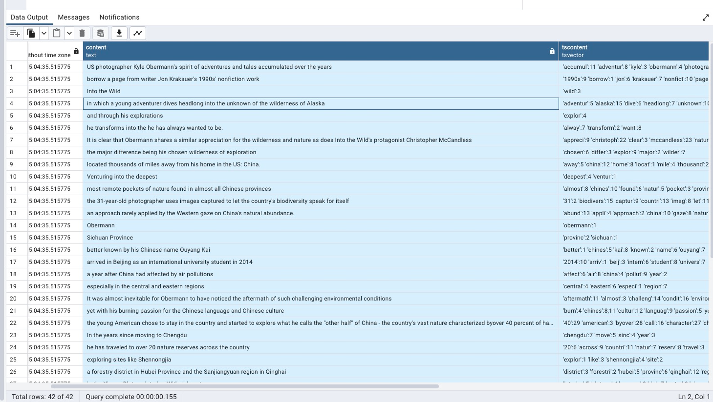
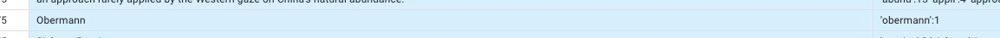

## 概念
  全文搜索即给定关键词, 在所有文档数据中寻找符合关键词的文档
  
## 过程
1. 获取原始文档数据
2. 对文档进行分析，分词（所为分词，就是按照分词符，如空格，将一句话分隔成若干的单词） 
3. 存档存入数据库，并通过分词建立索引
4. 查询时根据关键词，通过索引查询到索引指向的数据

Postgresql1可以配合它的GIN索引，Postgresql的全文检索具有很高的查询性能

## Postgresql的全文检索原理
Postgresql会对长文本进行分词，分词的标准一般是按照空格进行拆分。分词之后长文本实际上被分成了很多个key的集合，这个key的集合叫做tsvector。所有的搜索都是在tsvector中进行的。

### to_tsvector
to_tsvector会把文档中的关键词提取出来(分词), 省略那些主谓宾虚词等。

```postgresql
//将长字符串声明成了tsvector类型，Postgresql就自动按照空格对其进行了分词，并打印出来
ppostgres=# select 'I am going to eat'::tsvector;
tsvector
-----------------------------
 'I' 'am' 'eat' 'going' 'to'
(1 row)

//eat go 是tsvector所提取的关键词，冒号后面的数字是词在句子中的位置
postgres=# select to_tsvector('I am going to eat');
to_tsvector
----------------
 'eat':5 'go':3
(1 row)
```
tssvector会自动忽略掉I、Well等等这类主语词或者谓词、虚词  
to_tsvector函数在内部调用了一个`解析器`，它把文档文本分解成记号并且为每一种记号分配一个类型。对于每一个记号，会去查询一个词典列表，该列表会根据记号的类型而变化。第一个识别记号的词典产生一个或多个正规化的词位来表示该记号。

### 检索条件 tsquery

```postgresql
//'we & eat'的意思就是查询条件中既包含‘we’这个单词，也包括'eat'这个单词
postgres=# select 'we & eat'::tsquery;
   tsquery
--------------
 'we' & 'eat'
(1 row)
       
//和tsvector类似，将字符串转换成tsquery类型, to_tsquery也忽略了we这个主语单词
postgres=# select to_tsquery('we & eat');
to_tsquery
------------
 'eat'
(1 row)

//使用tsquery进行查询
postgres=# select 'I am going to eat'::tsvector @@ 'we & eat'::tsquery;
 ?column?
----------
 f
(1 row)

//使用tsquery进行查询
postgres=# select 'I am going to eat'::tsvector @@ 'we | eat'::tsquery;
 ?column?
----------
 t
(1 row)
```


### 创建表和数据

```postgresql
1. 创建blog表
postgres=# create table blog (id serial,recoredtime timestamp default now(),content text);

2. 插入数据
postgres=# \COPY blog(content) FROM '/Users/a123/Desktop/1.txt';
COPY 42

postgres=# select count(*) from blog;
count
-------
    42
(1 row)
    
3. 添加tsvector列
postgres=# alter table blog add column tscontent tsvector;
ALTER TABLE
postgres=# update blog set tscontent=to_tsvector(content);
UPDATE 42
```



### 搜索

```postgresql
postgres=# explain (analyze,verbose,buffers,costs,timing) select * from blog where tscontent @@ 'obermann'::tsquery;
QUERY PLAN
---------------------------------------------------------------------------------------------------------------
 Seq Scan on public.blog  (cost=0.00..635.17 rows=2136 width=196) (actual time=0.446..4.467 rows=2136 loops=1)
   Output: id, recoredtime, content, tscontent
   Filter: (blog.tscontent @@ '''obermann'''::tsquery)
   Rows Removed by Filter: 9078
   Buffers: shared hit=495
 Planning:
   Buffers: shared hit=5 dirtied=2
 Planning Time: 0.300 ms
 Execution Time: 4.754 ms
(9 rows)
```

搜索出2136行数据，用时4.754 ms

### 创建gin索引
```postgresql
postgres=# create index on blog using gin(tscontent);
CREATE INDEX
postgres=# \d blog
                                         Table "public.blog"
   Column    |            Type             | Collation | Nullable |             Default
-------------+-----------------------------+-----------+----------+----------------------------------
 id          | integer                     |           | not null | nextval('blog_id_seq'::regclass)
 recoredtime | timestamp without time zone |           |          | now()
 content     | text                        |           |          |
 tscontent   | tsvector                    |           |          |
Indexes:
    "blog_tscontent_idx" gin (tscontent)
```

### 用gin搜索
```postgresql
postgres=# explain (analyze,verbose,buffers,costs,timing) select * from blog where tscontent @@ 'obermann'::tsquery;
                                                            QUERY PLAN
----------------------------------------------------------------------------------------------------------------------------------
 Bitmap Heap Scan on public.blog  (cost=28.55..550.25 rows=2136 width=196) (actual time=0.354..1.543 rows=2136 loops=1)
   Output: id, recoredtime, content, tscontent
   Recheck Cond: (blog.tscontent @@ '''obermann'''::tsquery)
   Heap Blocks: exact=322
   Buffers: shared hit=325
   ->  Bitmap Index Scan on blog_tscontent_idx  (cost=0.00..28.02 rows=2136 width=0) (actual time=0.304..0.305 rows=2136 loops=1)
         Index Cond: (blog.tscontent @@ '''obermann'''::tsquery)
         Buffers: shared hit=3
 Planning:
   Buffers: shared hit=11
 Planning Time: 32.915 ms
 Execution Time: 1.898 ms
(12 rows)
```

搜索出2136行数据，用时1.898 ms

### 用like搜索
```postgresql
postgres=# explain (analyze,verbose,buffers,costs,timing) select * from blog where content like '%obermann%';
QUERY PLAN
---------------------------------------------------------------------------------------------------------
 Seq Scan on public.blog  (cost=0.00..635.17 rows=1 width=196) (actual time=5.006..5.007 rows=0 loops=1)
   Output: id, recoredtime, content, tscontent
   Filter: (blog.content ~~ '%obermann%'::text)
   Rows Removed by Filter: 11214
   Buffers: shared hit=495
 Planning Time: 0.115 ms
 Execution Time: 5.055 ms
(7 rows)
```

这里的obermann是一个人名,其有obermann和Obermann2种，但tsvector会将其小写化变成obermann
因此用tsvector配合gin索引搜索出来有2136个结果，但是用like却只能得出上1行结果


1. like模糊查询要进行全表扫描，查询起来会相当吃力，性能很低； 
2. 查询结果中包含了所有mother这个字符串的数据，无法做到精确匹配。