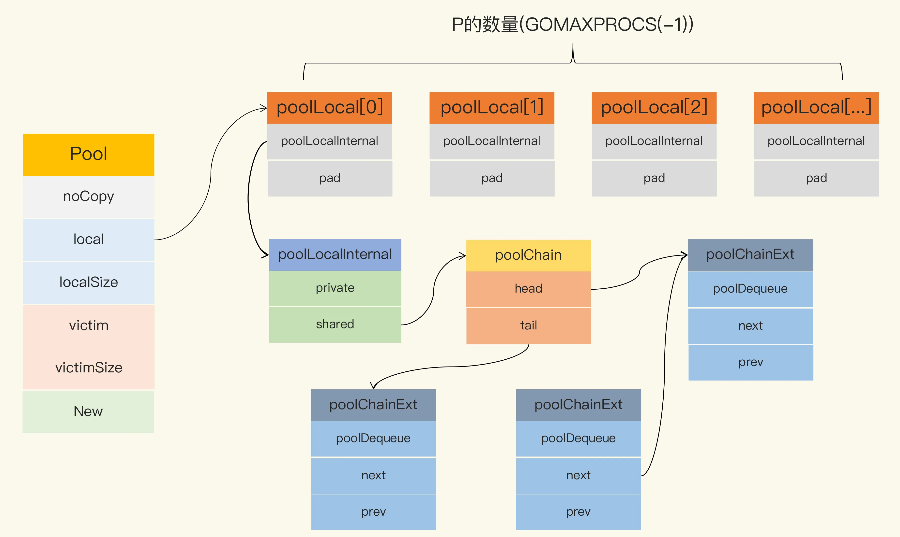

## pool

```go
    var (
        allPoolsMu Mutex //全局锁
        // allPools is the set of pools that have non-empty primary
        // caches. Protected by either 1) allPoolsMu and pinning or 2)
        // STW.
        allPools []*Pool
        // oldPools is the set of pools that may have non-empty victim
        // caches. Protected by STW.
        oldPools []*Pool
	)

	// A Pool must not be copied after first use.
	type Pool struct {
        // 不允许复制
        noCopy noCopy
        // 池的固定大小, local 对应类似 poolLocal，是一个数组
        local     unsafe.Pointer // local fixed-size per-P pool, actual type is [P]poolLocal
        localSize uintptr        // size of the local array
        victim     unsafe.Pointer // local from previous cycle
        victimSize uintptr        // size of victims array
        // New optionally specifies a function to generate
        // a value when Get would otherwise return nil.
        // It may not be changed concurrently with calls to Get.
        // 可选项，当使用Get获取对象时调用此函数，返回值是一个接口，意味着可以返回任意内容。如果不指定此函数将返回nil。
        // 不能在调用Get() 时修改此函数
        New func() interface{}
	}
```

当GC时，Pool会先把 oldPools 中的 victim 中的对象移除，然后把全局变量 allPools 中的 local 的数据再给 victim，同时对 local 清空和 localSize 置0。如果 victim 的对象被Get取走的话，此对象将会被保留。localSize 表示数组的大小。

当前所有空闲可用的元素都在 local 中存储，获取时优先从这里获取。

local 字段存储的是一个 poolLocal 数组指针，数组长度即为P的个数即 runtime.GOMAXPROCS(0)。这样每个P都会有自己的数据，访问时，P 的编号 ID 对应数组下标索引，这样就可以实现无锁访问，这一点对我们理解下面的逻辑很重要。

## 原理和流程

### New
Pool 有一个New变量，它的类型为 func() interface{}。函数返回值是一个接口类型，意味着我们可以返回任意内容。

此函数只有当Pool中没有空闲元素时才会调用，即创建一个元素并将其返回。如果不指定此变量，则默认会返回nil。

### Get

```go
// If Get would otherwise return nil and p.New is non-nil, Get returns
// the result of calling p.New.
func (p *Pool) Get() interface{} {
    if race.Enabled {
        race.Disable()
    }
    // 把当前goroutine固定在当前的P上
    l, pid := p.pin()
    // 1. 优先从当前P的 l.private 字段直接获取, 速度最快效率高
    x := l.private
    l.private = nil
    if x == nil {
        // 2. 获取不到，再从当前P的 share 头部获取一个(主要出于时间局部性考虑)
        // Try to pop the head of the local shard. We prefer
        // the head over the tail for temporal locality of
        // reuse.
        x, _ = l.shared.popHead()
        if x == nil {
            // 3. 仍获取不到，就从其它的P窃取一个，效率低
            x = p.getSlow(pid)
        }
    }
    // 解除goroutine与p绑定
    runtime_procUnpin()
    if race.Enabled {
        race.Enable()
        if x != nil {
            race.Acquire(poolRaceAddr(x))
        }
    }
    // 4. 最后仍没有获取到，直接创建一个
    if x == nil && p.New != nil {
        x = p.New()
    }
    return x
}

//检查如果当前 pid 小于 localSize，说明已存在对应的local直接返回。否则说明当前 P 是新创建的（runtime.GOMAXPROCS），
//所以缺少自己的poolLocal()，这时就需要调用 pinSlow() 来创建一个。
func (p *Pool) pin() (*poolLocal, int) {
    pid := runtime_procPin()
    // In pinSlow we store to local and then to localSize, here we load in opposite order.
    // Since we've disabled preemption, GC cannot happen in between.
    // Thus here we must observe local at least as large localSize.
    // We can observe a newer/larger local, it is fine (we must observe its zero-initialized-ness).
    s := runtime_LoadAcquintptr(&p.localSize) // load-acquire
    l := p.local                              // load-consume
    if uintptr(pid) < s {
    return indexLocal(l, pid), pid
    }
    return p.pinSlow()
}

//当P的数量发生变化，即增加个数时才会出现P找不到 localPool 的情况，这时将会重新分配一个当前P大小的 poolLocal 数组（实际上是切片类型）并赋值给 Pool.local，
//同时还有其大小 Pool.localSize ，而原来的 localPool 数组将丢弃。
func (p *Pool) pinSlow() (*poolLocal, int) {
    // 解除pin
    runtime_procUnpin()
    // 加全局锁
    allPoolsMu.Lock()
    defer allPoolsMu.Unlock()
    // 重新绑定pin
    pid := runtime_procPin()
    // poolCleanup won't be called while we are pinned.
    s := p.localSize
    l := p.local
    // 重新检查 如果当前pid值<localSize, 说明对应的 poolLocal 已存在,直接返回
    if uintptr(pid) < s {
    return indexLocal(l, pid), pid
    }
    // 当前Pool.local不存在，先将当前Pool对象放入 allPools 中，后期进行清理
    if p.local == nil {
    allPools = append(allPools, p)
    }
    // If GOMAXPROCS changes between GCs, we re-allocate the array and lose the old one.
    // 如果在GC期间，P 的数量发生变化，那么将会重新分配数据，从而丢失旧数组
    // 当前P的数量
    size := runtime.GOMAXPROCS(0)
	
	---------------------   重点部分 -----------------------
	
    // 创建当前P数量个poolLocal
    local := make([]poolLocal, size)
    // 将新创建的 localPool 数组首个元素地址赋值给 &Pool.local 字段，同时也更新 Pool.localSize 字段值
    // 这里表示使用新的Pool.local 和Pool.localSize
    atomic.StorePointer(&p.local, unsafe.Pointer(&local[0])) // store-release
    runtime_StoreReluintptr(&p.localSize, uintptr(size))     // store-release
	
	---------------------   重点部分 -----------------------
	
    return &local[pid], pid
}
```

#### Get 获取元素的顺序

1. 先从 l.private 取元素
2. 若取不到，再从列表 l.share 头部获取
3. 还是取不到，就调用 p.getSlow() 从其它P的share尾部中的 poolDequeue 执行 popTail 窃取一个
4. 从其他P窃取不到，那就去当前P的 vintim 中获取一个，先从当前P的 victim 中的private获取，取不到再考虑从其它 victim 中的share中获取
4. 最后仍没有取到，直接能用指定的 p.New 函数创建一个并返回，如果未指定此变量，则返回nil


### Put
如果private为nil 的话，就将元素放在private，否则放在share 列表的头部。
```go
// Put adds x to the pool.
func (p *Pool) Put(x interface{}) {
    if x == nil {
        return
    }

    // 将goroutine固定在P上
    l, _ := p.pin()

    // 优先将元素放在 private，如果当前private为空的话
    if l.private == nil {
        l.private = x
        x = nil
    }

    // 如果private已经有元素了，就将当前元素放在 share 列表的头部
    if x != nil {
        l.shared.pushHead(x)
    }
    runtime_procUnpin()
}
```


## poolDequeue

poolDequeue，用来存放真正的数据。一个PoolDequeue 就是一个固定大小的环，其中 headTail 指向环的首位置，vals 表示环中的元素，
为切片类型。环的大小为8倍数，最小为8，当环状队列写入满的时候，会创建一个原来大小两倍的环, 见 [poolChain.pushHead()](https://github.com/golang/go/blob/master/src/sync/poolqueue.go#L228-L256) 方法

```go
type poolChain struct {
    head *poolChainElt
    tail *poolChainElt
}
type poolChainElt struct {
    poolDequeue
    next, prev *poolChainElt
}
type poolDequeue struct {
    headTail uint64
    vals []eface
}

func (c *poolChain) popTail() (any, bool) {
    d := loadPoolChainElt(&c.tail)
    if d == nil {
        return nil, false
    }
    
    for {
        // It's important that we load the next pointer
        // *before* popping the tail. In general, d may be
        // transiently empty, but if next is non-nil before
        // the pop and the pop fails, then d is permanently
        // empty, which is the only condition under which it's
        // safe to drop d from the chain.
        d2 := loadPoolChainElt(&d.next)
        
        if val, ok := d.popTail(); ok {
            return val, ok
        }
        
        if d2 == nil {
            // This is the only dequeue. It's empty right
            // now, but could be pushed to in the future.
            return nil, false
        }
        
        // The tail of the chain has been drained, so move on
        // to the next dequeue. Try to drop it from the chain
        // so the next pop doesn't have to look at the empty
        // dequeue again.
		
		//并发同时从尾部取元素所用到的atomic机制，必定会只有一个成功获取到元素
        if atomic.CompareAndSwapPointer((*unsafe.Pointer)(unsafe.Pointer(&c.tail)), unsafe.Pointer(d), unsafe.Pointer(d2)) {
            // We won the race. Clear the prev pointer so
            // the garbage collector can collect the empty
            // dequeue and so popHead doesn't back up
            // further than necessary.
            storePoolChainElt(&d2.prev, nil)
        }
        d = d2
    }
}
```