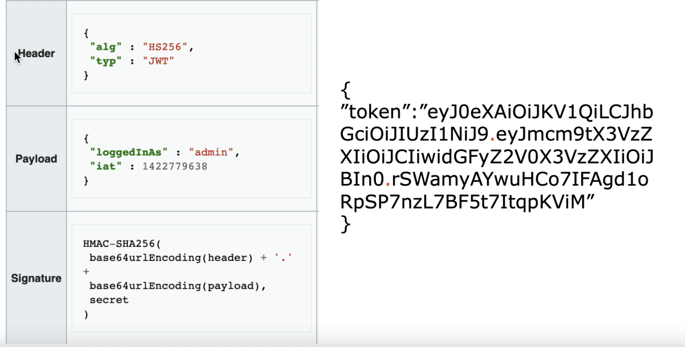

### 简要
&ensp;&ensp;JWT的全称是Json Web Token。它遵循JSON格式，将用户信息加密到token里，服务器不保存任何用户信息，只保存密钥信息，通过使用特定加密算法验证token，
通过token验证用户身份。基于token的身份验证可以替代传统的cookie+session身份验证方法。 

### 组成（中间用点分割，即header.payload.signature）
- header（头部）：用于描述关于该JWT的最基本的信息，例如其类型以及签名所用的算法等
- payload（有效载荷）：存储需要传递的信息
- signature（签名）：对header和payload进行签名，保证token在传输的过程中没有被篡改或者损坏

### 优点
- 通过自定义的签名，让JWT防止被篡改，安全性高
- 可以再令牌中自定义丰富的字段内容，易扩展（payload可以扩展）
- 资源服务使用JWT可不依赖认证服务即可完成授权，只需解析验证token
- jwt基于json，方便解析