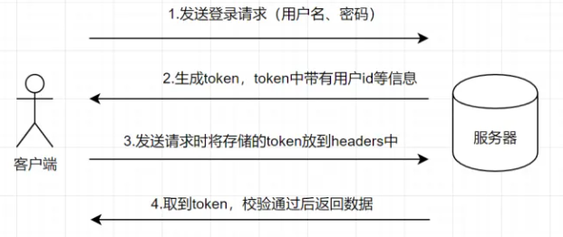

### Cookie
&ensp;&ensp;cookie 是保存在客户端或者说浏览器中的一小块数据，大小限制大致在 4KB 左右。  

&ensp;&ensp;缺点
- cookie 有存储大小限制，4KB 左右。
- 浏览器每次请求会携带 cookie 在请求头中。
- 字符编码为 Unicode，不支持直接存储中文。
- 数据可以被轻易查看。

&ensp;&ensp;特点
- cookie 存储在客户端
- cookie 不可跨域，但是在如果设置了 domain，那么它们是可以在一级域名和二级域名之间共享的

&ensp;&ensp;属性
- name：cookie 的名称
- value：cookie 的值
- comment：cookie 的描述信息
- domain：可以访问该 cookie 的域名
- expires：cookie 的过期时间，具体某一时间
- maxAge：cookie 的过期时间，比如多少秒后 cookie 过期。
- path：cookie 的使用路径，
- secure：cookie 是否使用安全协议传输，比如 SSL 等
- version：cookie 使用的版本号
- isHttpOnly：指定该 Cookie 无法通过 JavaScript 脚本拿到，比如 Document.cookie 属性、XMLHttpRequest 对
象和 Request API 都拿不到该属性。这样就防止了该 Cookie 被脚本读到，只有浏览器发出 HTTP 请求时，才会带上
该 Cookie。

&ensp;&ensp;使用 cookie 认证过程
1. client 发送请求到 service
2. service 生成一个 session 会话
3. service 响应 client ，并在响应头中设置 Set-Cookie。Set-Cookie 里面包含了 sessionId，其中 sessionId 就是用来标识client
4. client 收到请求后，如果 service 设置了 Set-Cookie 字段， 那么下次浏览器就会在请求头中自动携带 cookie
5. client 发送其它请求，自动携带了 cookie，cookie 中携带有用户信息等
6. service 接收到请求，验证 cookie 信息，比如通过 sessionId 来判断是否存在会话，存在则正常响应

### Session
&ensp;&ensp;session 由服务端创建，当一个请求发送到服务端时，服务器会检索该请求里面有没有包含 sessionId 标识，如果包含了 sessionId，则代表服务端已经和客户端创建过 session，然后就通过这个 sessionId 去查找真正的 session，
如果没找到，则为客户端创建一个新的 session， 并生成一个新的 sessionId 与 session 对应，然后在响应的时候将 sessionId 给客户端，通常是存储在 cookie 中。如果在请求中找到了真正的 session，验证通过，正常处理该请求  
&ensp;&ensp;通常情况下， cookie 和 session 都是结合着来用  

&ensp;&ensp;简要概述
- session 是另一种记录服务器和客户端会话状态的机制
- session 是基于 cookie 实现的，session 存储在服务器端，sessionId 会被存储到客户端的cookie 中

&ensp;&ensp;缺点
- 每次认证用户发起请求时，服务器需要去创建一个记录来存储信息。当越来越多的用户发请求时，服务器端内存的开销也会不断增加
- 可扩展性：在服务端使用 Session 存储登录信息，伴随而来的是可扩展性问题, 多个服务器之间如何同步sessionID
- CORS(跨域资源共享)
- CSRF(跨站请求伪造)

### token
&ensp;&ensp;token 其实就是一串字符串而已，只不过它是被加密后的字符串，它通常使用 uid(用户唯一标识)、时间戳、签名以及一些其它参数加密而成。
我们将 token 进行`解密` 就可以拿到诸如 uid 这类的信息，然后通过 uid 来进行接下来的鉴权操作

&ensp;&ensp;基于Token的身份验证的过程如下:
1. 用户通过用户名和密码发送请求。
2. 服务端验证, 返回生成的token 给客户端, 同时给数据库和Redis里关联token和用户信息。
3. 客户端储存token,并且其后的每一次请求都添加token, token应该在HTTP的头部发送从而保证了Http请求无状态。
4. 服务端查询Redis+数据库, 验证token并返回数据。

### 总结
session 是空间换时间，token 是时间换空间