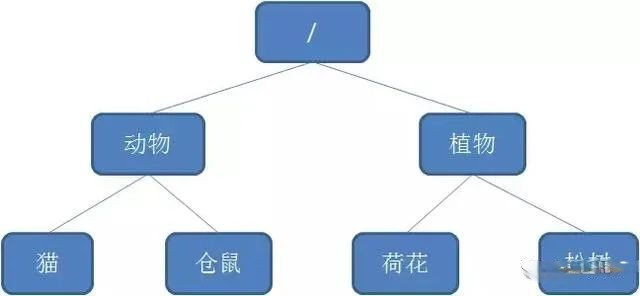
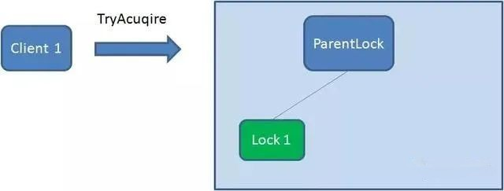
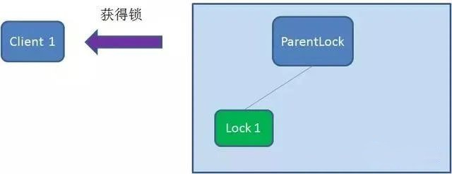
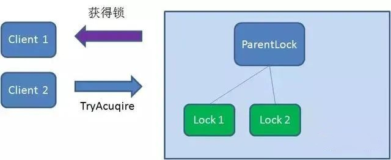
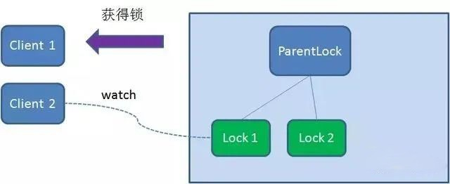
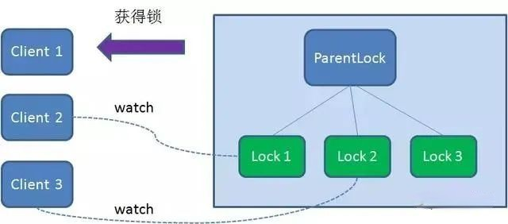
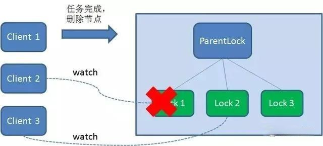
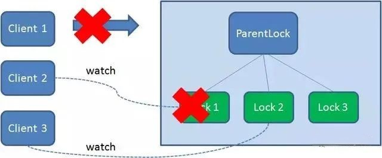
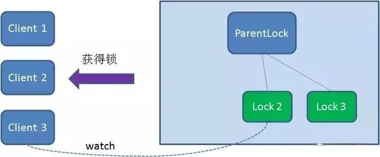
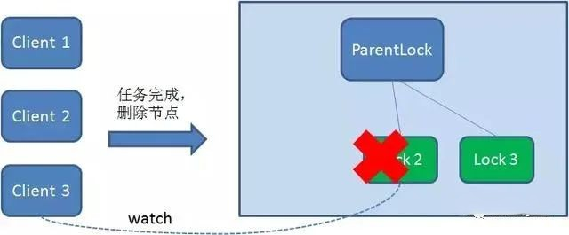

## CAP理论
任何一个分布式系统都无法同时满足一致性（Consistency）、可用性（Availability）和分区容错性（Partition tolerance），最多只能同时满足两项。  

很多系统在设计之初就要对这三者做出取舍。在互联网领域的绝大多数的场景中，都需要牺牲强一致性来换取系统的高可用性，系统往往只需要保证“最终一致性”，只要这个最终时间是在用户可以接受的范围内即可。

## 分布式锁应该具备哪些条件
1. 在分布式系统环境下，一个方法在同一时间只能被一个机器的一个线程执行； 
2. 高可用的获取锁与释放锁； 
3. 高性能的获取锁与释放锁； 
4. 具备可重入特性； 
5. 具备锁失效机制，防止死锁； 
6. 具备非阻塞锁特性，即没有获取到锁将直接返回获取锁失败。

## 实现方式
1. 基于数据库实现分布式锁； 
2. 基于缓存（Redis等）实现分布式锁； 
3. 基于Zookeeper实现分布式锁；

### 基于数据库实现分布式锁

#### 简单的方案
新建一张表，用于存储锁的信息，需要加锁的时候就插入一条记录，释放锁的时候就删除这条记录
```
CREATE TABLE `t_lock` (
  `lock_key` varchar(64) NOT NULL COMMENT '锁的标识',
  PRIMARY KEY (`lock_key`)
) ENGINE=InnoDB DEFAULT CHARSET=utf8mb4 COMMENT='分布式锁'

//根据插入sql返回受影响的行数，大于0表示成功占有锁
insert ignore into t_lock(lock_key) values("lockKey")

//释放锁的时候就删除记录
delete from t_lock where lock_key = "lockKey"
```
缺点: 
1. 强依赖数据库的可用性，数据库是一个单点，一旦数据库挂掉，会导致业务系统不可用
   -  解决方案：搞两个数据库，数据之前双向同步。一旦挂掉快速切换到备库上
2. 没有失效时间，一旦解锁操作失败，就会导致锁记录一直在数据库中，其他线程无法再获得到锁。
   -  解决方案：做一个定时任务，每隔一定时间把数据库中的超时数据清理一遍
3. 只能是非阻塞的，因为数据的insert操作，一旦插入失败就会直接报错。没有获得锁的线程并不会进入排队队列，要想再次获得锁就要再次触发获得锁操作
   -  解决方案：搞一个循环，直到insert成功再返回成功。
4. 非重入的，同一个线程在没有释放锁之前无法再次获得该锁。因为数据中数据已经存在了。
   -  解决方案：在数据库表中加个字段，记录当前获得锁的机器的主机信息和线程信息，那么下次再获取锁的时候先查询数据库，如果当前机器的主机信息和线程信息在数据库可以查到的话，直接把锁分配

#### 基于排他锁（for update）实现
1. 获取锁可以通过，在select语句后增加for update，数据库会在查询过程中给数据库表增加排他锁。当某条记录被加上排他锁之后，其他线程无法再在该行记录上增加排他锁，我们可以认为获得排它锁的线程即可获得分布式锁； 
2. 其余实现与使用唯一索引相同； 
3. 释放锁通过connection.commit();操作，提交事务来实现

`for update可以参考database/mysql/for_update.md`

缺点：
1. 排他锁会占用连接，产生连接爆满的问题； 
2. 如果表不大，可能并不会使用行锁； 
3. 同样存在单点问题、并发量问题

#### 乐观锁
一般是通过为数据库表添加一个 version 字段来实现读取出数据时，将此版本号一同读出.

之后更新时，对此版本号加1，在更新过程中，会对版本号进行比较，如果是一致的，没有发生改变，则会成功执行本次操作；如果版本号不一致，则会更新失败。

实际就是个CAS过程。

缺点:
1. 这种操作方式，使原本一次的update操作，必须变为2次操作: select版本号一次；update一次。增加了数据库操作的次数。
2. 如果业务场景中的一次业务流程中，多个资源都需要用保证数据一致性，那么如果全部使用基于数据库资源表的乐观锁，就要让每个资源都有一张资源表，这个在实际使用场景中肯定是无法满足的。而且这些都基于数据库操作，`在高并发的要求下，对数据库连接的开销一定是无法忍受的`

#### 总结
优点
1. 直接借助DB简单易懂。 
2. 方便快捷，因为基本每个服务都会连接数据库，但是不是每个服务都会使用redis或者zookeeper； 
3. 如果客户端断线了会自动释放锁，不会造成锁一直被占用； 
4. mysql分布式锁是可重入锁，对于旧代码的改造成本低；

缺点
1. `加锁直接打到数据库，增加了数据库的压力`； 
2. `加锁的线程会占用一个session，也就是一个连接数，如果并发量大可能会导致正常执行的sql语句获取不到连接`； 
3. 服务拆分后如果每个服务使用自己的数据库，则不合适； 
4. `锁的可用性和数据库强关联，一旦数据库挂了，则整个分布式锁不可用`； 
5. 如果需要考虑极限情况，会有超时等各种问题，在解决问题的过程中会使整个方案变得越来越复杂； 
6. `数据库的性能瓶颈相较于redis、zk要低很多，当调用量大的时候，性能问题将成为关键`； 
7. 还需要考虑`超时等问题`。

### 基于缓存（Redis等）实现分布式锁
```
setnx key value //键不存在时，才能成功，若键存在，什么也不做，成功返回1，失败返回0
```
setnx命令的作用就是当我们的redis中没有这个key的键值队时，就会创建这个键值队的值，如果已经有了这个key就不作操作；所以我们可以使用setnx命令来实现我们的分布式加锁操作。但setnx的命令会存在风险

setnx没有给锁设置过期时间，一旦客户端故障没有进行释放锁操作，就将导致没有办法在获得锁

```redis
SET key value[EX seconds][PX milliseconds][NX|XX] 

EX seconds: 设定过期时间，单位为秒
PX milliseconds: 设定过期时间，单位为毫秒
NX: 仅当key不存在时设置值
XX: 仅当key存在时设置值
```

缺点：
在这种场景（主从结构）中存在明显的竞态:
客户端A从master获取到锁，在master将锁同步到slave之前，master宕掉了。slave节点被晋级为master节点，客户端B取得了同一个资源被客户端A已经获取到的另外一个锁。安全失效！

### 基于zookeeper实现

Zookeeper的数据存储结构就像一棵树，这棵树由节点组成，这种节点叫做Znode

#### Znode分为四种类型
1. 持久节点 （PERSISTENT）: 默认的节点类型。创建节点的客户端与zookeeper断开连接后，该节点依旧存在 。
2. 持久节点顺序节点（PERSISTENT_SEQUENTIAL）:所谓顺序节点，就是在创建节点时，Zookeeper根据创建的时间顺序给该节点名称进行编号：
3. 临时节点（EPHEMERAL）:和持久节点相反，当创建节点的客户端与zookeeper断开连接后，临时节点会被删除：
4. 临时顺序节点（EPHEMERAL_SEQUENTIAL）:顾名思义，临时顺序节点结合和临时节点和顺序节点的特点：在创建节点时，Zookeeper根据创建的时间顺序给该节点名称进行编号；当创建节点的客户端与zookeeper断开连接后，临时节点会被删除。

#### 分布式锁实现原理
主要利用临时顺序节点

精简步骤
1. 创建一个目录mylock； 
2. 线程A想获取锁就在mylock目录下创建临时顺序节点； 
3. 获取mylock目录下所有的子节点，然后获取比自己小的兄弟节点，如果不存在，则说明当前线程顺序号最小，获得锁； 
4. 线程B获取所有节点，判断自己不是最小节点，设置监听比自己次小的节点； 
5. 线程A处理完，删除自己的节点，线程B监听到变更事件，判断自己是不是最小的节点，如果是则获得锁。

##### 获取锁
1. 首先，在Zookeeper当中创建一个持久节点ParentLock。当第一个客户端想要获得锁时，需要在ParentLock这个节点下面创建一个临时顺序节点 Lock1。
   
2. 之后，Client1查找ParentLock下面所有的临时顺序节点并排序，判断自己所创建的节点Lock1是不是顺序最靠前的一个。如果是第一个节点，则成功获得锁。
   
3. 这时候，如果再有一个客户端 Client2 前来获取锁，则在ParentLock下载再创建一个临时顺序节点Lock2。
Client2查找ParentLock下面所有的临时顺序节点并排序，判断自己所创建的节点Lock2是不是顺序最靠前的一个，结果发现节点Lock2并不是最小的。
于是，Client2向排序仅比它靠前的节点Lock1注册Watcher，用于监听Lock1节点是否存在。这意味着Client2抢锁失败，进入了等待状态。
   
   
4. 这时候，如果又有一个客户端Client3前来获取锁，则在ParentLock下载再创建一个临时顺序节点Lock3。 
Client3查找ParentLock下面所有的临时顺序节点并排序，判断自己所创建的节点Lock3是不是顺序最靠前的一个，结果同样发现节点Lock3并不是最小的。 
于是，Client3向排序仅比它靠前的节点Lock2注册Watcher，用于监听Lock2节点是否存在。这意味着Client3同样抢锁失败，进入了等待状态。
   
5. 这样一来，Client1得到了锁，Client2监听了Lock1，Client3监听了Lock2。这恰恰形成了一个等待队列

##### 释放锁

释放锁分为两种情况：
1.任务完成，客户端显示释放，Client1会显示调用删除节点Lock1的指令。

2.任务执行过程中，客户端崩溃, 则会断开与Zookeeper服务端的链接。根据临时节点的特性，相关联的节点Lock1会随之自动删除。


由于Client2一直监听着Lock1的存在状态，当Lock1节点被删除，Client2会立刻收到通知。这时候Client2会再次查询ParentLock下面的所有节点，确认自己创建的节点Lock2是不是目前最小的节点。如果是最小，则Client2顺理成章获得了锁。
同理，如果Client2也因为任务完成或者节点崩溃而删除了节点Lock2，那么Client3就会接到通知。



缺点： 性能上可能并没有缓存服务那么高。因为每次在创建锁和释放锁的过程中，都要动态创建、销毁瞬时节点来实现锁功能。ZK中创建和删除节点只能通过Leader服务器来执行，然后将数据同不到所有的Follower机器上。