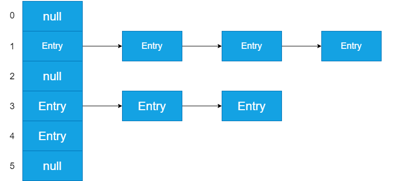

### 哈希表 
&ensp;&ensp;散列表（Hash table，也叫哈希表），是根据关键码值(Key value)而直接进行访问的数据结构。也就是说，它通过把关键码值映射到表中一个位置来访问记录，以加快查找的速度。这个映射函数叫做散列函数，存放记录的数组叫做散列表。  
&ensp;&ensp;给定表M，存在函数f(key)，对任意给定的关键字值key，代入函数后若能得到包含该关键字的记录在表中的地址，则称表M为

#### 时间复杂度
&ensp;&ensp;O(1)

#### 哈希冲突解决方法
- 开放地址法：指的是将哈希表中的「空地址」向处理冲突开放。当哈希表未满时，处理冲突时需要尝试另外的单元，直到找到空的单元为止
- 链地址法：将具有相同哈希地址的元素（或记录）存储在同一个线性链表中
- 再哈希法：提供多个哈希函数，如果第一个哈希函数计算出来的key的哈希值冲突了，则使用第二个哈希函数计算key的哈希值
- 建立公共溢出区：将哈希表分为基本表和溢出表两部分，凡是和基本表发生冲突的元素，一律填入溢出表

#### 如何利用现在的数据结构实现一个哈希表
&ensp;&ensp;数组 + 链表
##### 数组
&ensp;&ensp;访问数组里面某个元素，直接可以通过内存地址去访问，从而避免一次一次的去和数组里面的元素比对的过程。在对比过程中，
最好的情况要查找的元素就在数组索引为0的位置，时间复杂度为o(1)，最坏的肯定就是目标元素在数组最后位置，时间复杂度为o(n) (n为数组长度)
##### 链表
&ensp;&ensp;链表这种数据结构效率最高的就是新增和删除，时间复杂度能够达到最理想的o(1)，
无论是新增和删除，只需要找到目标结点的上一结点，修改该结点的next域即可。
##### 结构图
