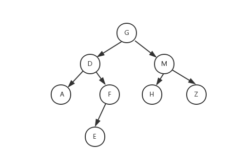

先序遍历：根节点->左子树->右子树（根->左->右）

    printf("data = %c level = %d\n ", t->data, level);
    PreOrderTraverse(t->leftChild, level + 1);
    PreOrderTraverse(t->rightChild, level + 1);

中序遍历：左子树->根节点->右子树（左->根->右）

    PreOrderTraverse(t->leftChild, level + 1);
    printf("data = %c level = %d\n ", t->data, level);
    PreOrderTraverse(t->rightChild, level + 1);

后序遍历：左子树->右子树->根节点（左->右->根）

    PreOrderTraverse(t->leftChild, level + 1);
    PreOrderTraverse(t->rightChild, level + 1);
    exprintf("data = %c level = %d\n ", t->data, level);

先序遍历：GDAFEMHZ

中序遍历：ADEFGHMZ

后序遍历：AEFDHZMG

由上可以看出中、后序的开头都是A，因此选择题时要求后序或者中序，可以从已知的2个遍历结果去掉一部分答案

不同遍历结果的特点

1. 先序遍历的第一元素是整个二叉树的根节点

2. 中序遍历中根节点的左边的元素是左子树，根节点右边的元素是右子树

3. 后序遍历的最后一个元素是整个二叉树的根节点