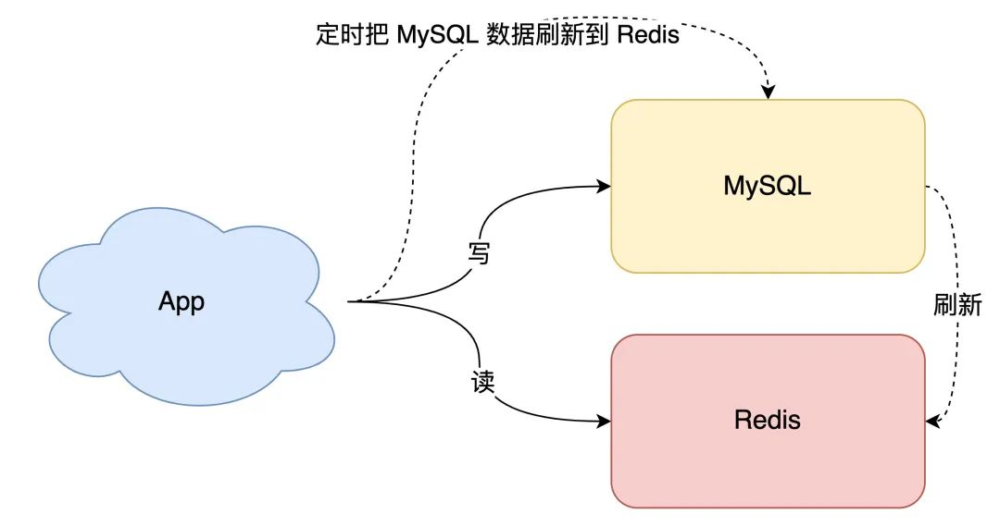
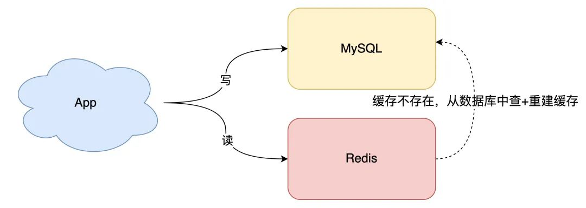
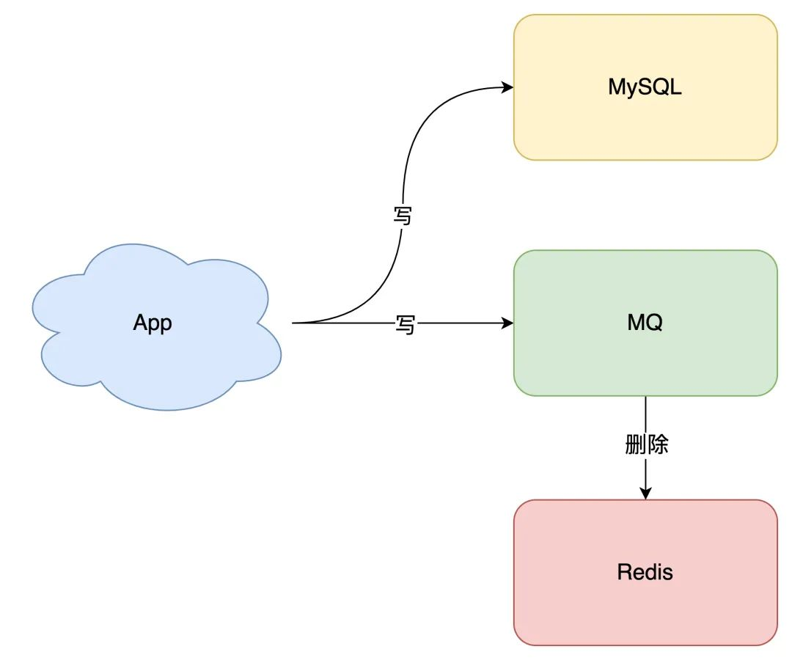
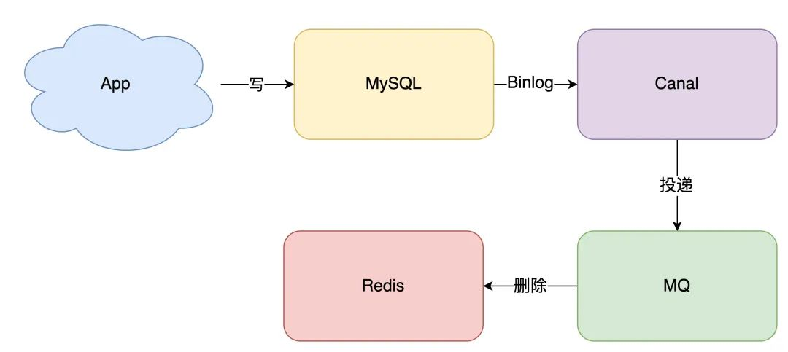

## 方案
想要保证数据库和缓存一致性，推荐采用`先更新数据库，再删除缓存`方案，并配合`消息队列`或`订阅变更日志`的方式来做。

## 缓存的适用场景
对于数据实时性要求不高, 对于一些经常访问但是很少改变的数据，读明显多于写，适用缓存就很有必要。比如一些网站配置项。

对于性能要求高，比如一些秒杀活动场景。

## 全量数据刷到缓存中
- 数据库的数据，全量刷入缓存（不设置失效时间）
- 写请求只更新数据库，不更新缓存
- 启动一个定时任务，定时把数据库的数据，更新到缓存中

优点: 所有读请求都可以直接`命中`缓存，不需要再查数据库，性能非常高

缺点:
1. 缓存利用率低：不经常访问的数据，还一直留在缓存中
2. 数据不一致：因为是`定时`刷新缓存，缓存和数据库存在不一致（取决于定时任务的执行频率）

因此该方案一般更适合业务`体量小`，且对数据一致性要求不高的业务场景

## 缓存利用率和一致性问题

### 利用率
想要利用率最大化，那么最容易的方案是缓存中保留最近访问的`热数据`

做法:
1. 写请求依旧只写数据库
2. 读请求先读缓存，如果缓存不存在，则从数据库读取，并重建缓存
3. 同时，写入缓存中的数据，都设置失效时间

这样一来，缓存中不经常访问的数据，随着时间的推移，都会逐渐`过期`淘汰掉，最终缓存中保留的，都是经常被访问的`热数据`，缓存利用率得以最大化。

### 一致性
当数据发生更新时，我们不仅要操作数据库，还要一并操作缓存。具体操作就是，修改一条数据时，不仅要更新数据库，也要连带缓存一起更新。

但数据库和缓存都更新，又存在先后问题，那对应的方案就有 2 个：
1. 先更新缓存，后更新数据库 
2. 先更新数据库，后更新缓存

## 先更新数据库，后更新缓存

### 异常情况
例如: 第一步成功、第二步失败

如果数据库更新成功了，但缓存更新失败，那么此时数据库中是最新值，缓存中是`旧值`。

之后的读请求读到的都是旧数据，只有当缓存`失效`后，才能从数据库中得到正确的值。

这时用户会发现，自己刚刚修改了数据，但却看不到变更，一段时间过后，数据才变更过来，对业务也会有影响。

### 并发情况
有线程 A 和线程 B 两个线程，需要更新`同一条`数据，会发生这样的场景：

1. 线程 A 更新数据库（X = 1） 
2. 线程 B 更新数据库（X = 2） 
3. 线程 B 更新缓存（X = 2） 
4. 线程 A 更新缓存（X = 1）

最终 X 的值在缓存中是 1，在数据库中是 2，发生不一致。

也就是说，A 虽然先于 B 发生，但 B 操作数据库和缓存的时间，却要比 A 的时间短，执行时序发生`错乱`，最终这条数据结果是不符合预期的。

## 先更新缓存，后更新数据库

### 异常情况
例如: 第一步成功、第二步失败

如果缓存更新成功了，但数据库更新失败，那么此时缓存中是最新值，但数据库中是`旧值`。

虽然此时读请求可以命中缓存，拿到正确的值，但是，一旦缓存`失效`，就会从数据库中读取到`旧值`，重建缓存也是这个旧值。

这时用户会发现自己之前修改的数据又`变回去`了，对业务造成影响。

### 并发情况
同理

## 方案：删除缓存(解决并发情况)
删除缓存对应的方案也有 2 种：
1. 先删除缓存，后更新数据库 
2. 先更新数据库，后删除缓存

### 并发问题
#### 先删除缓存，后更新数据库

如果有 2 个线程要并发`读写`数据，可能会发生以下场景：

1. 线程 A 要更新 X = 2（原值 X = 1） 
2. 线程 A 先删除缓存 
3. 线程 B 读缓存，发现不存在，从数据库中读取到旧值（X = 1） 
4. 线程 A 将新值写入数据库（X = 2） 
5. 线程 B 将旧值写入缓存（X = 1）

最终 X 的值在缓存中是 1（旧值），在数据库中是 2（新值），发生不一致。

可见，先删除缓存，后更新数据库，当发生`读+写`并发时，还是存在数据不一致的情况

#### 先更新数据库，后删除缓存

依旧是 2 个线程并发`读写`数据：

1. 缓存中 X 不存在（数据库 X = 1）
2. 线程 A 读取数据库，得到旧值（X = 1）
3. 线程 B 更新数据库（X = 2)
4. 线程 B 删除缓存
5. 线程 A 将旧值写入缓存（X = 1）

最终 X 的值在缓存中是 1（旧值），在数据库中是 2（新值），也发生不一致。

这种情况发生概率`很低`，这是因为它必须满足 3 个条件：

1. 缓存刚好已失效 
2. 读请求 + 写请求并发 
3. 更新数据库 + 删除缓存的时间（步骤 3-4），要比读数据库 + 写缓存时间短（步骤 2 和 5）

仔细想一下，条件 3 发生的概率其实是非常低的。

因为写数据库一般会先`加锁`，所以写数据库，通常是要比读数据库的时间更长的。

这么来看，`先更新数据库 + 再删除缓存`的方案，是可以保证数据一致性的。

## 方案: 异步重试(解决异常问题)

### 普通的重试
无论是先操作缓存，还是先操作数据库，但凡后者执行失败了，我们就可以发起重试，尽可能地去做`补偿`。

那这是不是意味着，只要执行失败，我们`无脑重试`就可以了呢？

答案是否定的。现实情况往往没有想的这么简单，失败后立即重试的问题在于：

1. 立即重试很大概率`还会失败` 
2. `重试次数`设置多少才合理？ 
3. 重试会一直`占用`这个线程资源，无法服务其它客户端请求

### 异步重试
异步重试其实就是把重试请求写到`消息队列`中，然后由专门的消费者来重试，直到成功。

或者更直接的做法，为了避免第二步执行失败，我们可以把操作缓存这一步，直接放到消息队列中，由消费者来操作缓存。

问题：如果在执行失败的线程中一直重试，还没等执行成功，此时如果项目`重启`了，那这次重试请求也就`丢失`了，那这条数据就一直不一致了

优点:
1. 消息队列保证可靠性：写到队列中的消息，成功消费之前不会丢失（重启项目也不担心） 
2. 消息队列保证消息成功投递：下游从队列拉取消息，成功消费后才会删除消息，否则还会继续投递消息给消费者（符合我们重试的场景）

### 订阅数据库变更日志，再操作缓存
在修改数据时，`只需`修改数据库，无需操作缓存。

那什么时候操作缓存呢？这就和数据库的`变更日志`有关了。

拿 MySQL 举例，当一条数据发生修改时，MySQL 就会产生一条变更日志（Binlog），我们可以订阅这个日志，拿到具体操作的数据，然后再根据这条数据，去删除对应的缓存。

订阅变更日志，目前也有了比较成熟的开源中间件，例如阿里的 canal，使用这种方案的优点在于：
1. 无需考虑写消息队列失败情况：只要写 MySQL 成功，Binlog 肯定会有
2. 自动投递到下游队列：canal 自动把数据库变更日志`投递`给下游的消息队列

## 主从库延迟和延迟双删问题

### `先删除缓存，再更新数据库`方案，导致不一致的场景么？

2 个线程要并发`读写`数据，可能会发生以下场景：

1. 线程 A 要更新 X = 2（原值 X = 1） 
2. 线程 A 先删除缓存 
3. 线程 B 读缓存，发现不存在，从数据库中读取到旧值（X = 1） 
4. 线程 A 将新值写入数据库（X = 2） 
5. 线程 B 将旧值写入缓存（X = 1）

最终 X 的值在缓存中是 1（旧值），在数据库中是 2（新值），发生不一致

### 关于`读写分离 + 主从复制延迟`情况下，缓存和数据库一致性的问题。

在`先更新数据库，再删除缓存`方案下，`读写分离 + 主从库延迟`其实也会导致不一致：

1. 线程 A 更新主库 X = 2（原值 X = 1） 
2. 线程 A 删除缓存 
3. 线程 B 查询缓存，没有命中，查询`从库`得到旧值（从库 X = 1） 
4. 从库`同步`完成（主从库 X = 2） 
5. 线程 B 将`旧值`写入缓存（X = 1）

最终 X 的值在缓存中是 1（旧值），在主从库中是 2（新值），也发生不一致

问题的核心在于：缓存都被回种了`旧值`

### 解决方案: 缓存延迟双删策略
不能立即删，而是需要`延迟删`

解决第一个问题：在线程 A 删除缓存、更新完数据库之后，先`休眠一会`，再`删除`一次缓存。

解决第二个问题：线程 A 可以生成一条`延时消息`，写到消息队列中，消费者延时`删除`缓存。

这两个方案的目的，都是为了把缓存清掉，这样一来，下次就可以从数据库读取到最新值，写入缓存。

但问题又来了，这个`延迟删除`缓存，延迟时间到底设置要多久呢？

- 问题1：延迟时间要大于`主从复制`的延迟时间
- 问题2：延迟时间要大于线程 B 读取数据库 + 写入缓存的时间

因此建议采用`先更新数据库，再删除缓存`的方案，同时，要尽可能地保证`主从复制`不要有太大延迟，降低出问题的概率

## 可以做到强一致吗
想让缓存和数据库`强一致`，到底能不能做到呢？

其实很难。

要想做到强一致，最常见的方案是 2PC、3PC、Paxos、Raft 这类一致性协议，但它们的性能往往比较差，而且这些方案也比较复杂，还要考虑各种容错问题。

相反，这时我们换个角度思考一下，我们引入缓存的目的是什么？

没错，性能。

一旦我们决定使用缓存，那必然要面临一致性问题。性能和一致性就像天平的两端，无法做到都满足要求。

而且，就拿我们前面讲到的方案来说，当操作数据库和缓存完成之前，只要有其它请求可以进来，都有可能查到`中间状态`的数据。

所以如果非要追求强一致，那必须要求所有更新操作完成之前期间，不能有`任何请求`进来。

虽然我们可以通过加`分布锁`的方式来实现，但我们要付出的代价，很可能会超过引入缓存带来的性能提升。

所以，既然决定使用缓存，就必须容忍`一致性`问题，我们只能尽可能地去降低问题出现的概率。

同时我们也要知道，缓存都是有`失效时间`的，就算在这期间存在短期不一致，我们依旧有失效时间来兜底，这样也能达到最终一致。

## 总结
1. 想要提高应用的性能，可以引入`缓存`来解决

2. 引入缓存后，需要考虑缓存和数据库一致性问题，可选的方案有：`更新数据库 + 更新缓存`、`更新数据库 + 删除缓存`

3. 更新数据库 + 更新缓存方案，在`并发`场景下无法保证缓存和数据一致性，且存在`缓存资源浪费`和`机器性能浪费`的情况发生

4. 在更新数据库 + 删除缓存的方案中，`先删除缓存，再更新数据库`在`并发`场景下依旧有数据不一致问题，解决方案是`延迟双删`，但这个延迟时间很难评估，所以推荐用`先更新数据库，再删除缓存`的方案

5. 在`先更新数据库，再删除缓存`方案下，为了保证两步都成功执行，需配合`消息队列`或`订阅变更日志`的方案来做，本质是通过`重试`的方式保证数据一致性

6. 在`先更新数据库，再删除缓存`方案下，`读写分离 + 主从库延迟`也会导致缓存和数据库不一致，缓解此问题的方案是`延迟双删`，凭借经验发送`延迟消息`到队列中，延迟删除缓存，同时也要控制主从库延迟，尽可能降低不一致发生的概率

## 细节
1. 性能和一致性不能同时满足，为了性能考虑，通常会采用`最终一致性`的方案

2. 掌握缓存和数据库一致性问题，核心问题有 3 点：缓存利用率、并发、缓存 + 数据库一起成功 问题

3. 失败场景下要保证一致性，常见手段就是`重试`，同步重试会影响吞吐量，所以通常会采用异步重试的方案

4. 订阅变更日志的思想，本质是把权威数据源（例如 MySQL）当做 leader 副本，让其它异质系统（例如 Redis / Elasticsearch）成为它的 follower 副本，通过同步变更日志的方式，保证 leader 和 follower 之间保持一致

## Reference
1. https://mp.weixin.qq.com/s?__biz=MzAxMjUyNDQ5OA==&mid=2653578708&idx=1&sn=40e8cc3ada9198236c89bfc9cc219d49&chksm=806e4b69b719c27f8ee9fcab562fa9a12cae33ae23d9dde95f2aced158efd3ee4af205c73a01&scene=27