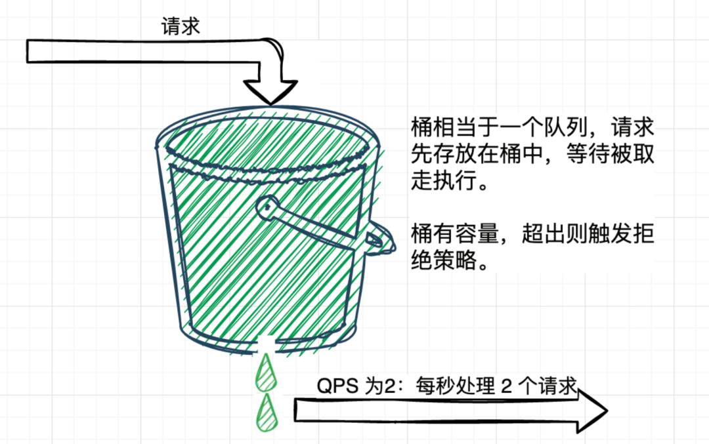

## 概念
在应对秒杀，大促等高性能压力的场景时，为了保证系统的平稳运行，必须针对超过预期的流量，通过预先设定的限流规则选择性的对某些请求进行限流“熔断”。

## 计数器算法
通过一个计数器 counter 来统计一段时间内请求的数量，并且在指定的时间之后重置计数器

缺点：会有临界问题

假设限流规则为每秒钟不超过 100 次接口请求，第一个 1s 时间窗口内，100 次接口请求都集中在最后的 10ms 内，
在第二个 1s 的时间窗口内，100 次接口请求都集中在最开始的 10ms 内，虽然两个时间窗口内流量都符合限流要求，但是在这两个时间窗口
临界的 20ms 内会集中有 200 次接口请求，如果不做限流，集中在这 20ms 内的 200 次请求就有可能压垮系统。

```redshift
-- redis lua
-- 实现原理
-- 每次请求都将当前时间，精确到秒作为 key 放入 Redis 中，超时时间设置为 2s， Redis 将该 key 的值进行自增
-- 当达到阈值时返回错误，表示请求被限流
-- 写入 Redis 的操作用 Lua 脚本来完成，利用 Redis 的单线程机制可以保证每个 Redis 请求的原子性

-- 资源唯一标志位
local key = KEYS[1]
-- 限流大小
local limit = tonumber(ARGV[1])

-- 获取当前流量大小
local currentLimit = tonumber(redis.call('get', key) or "0")

if currentLimit + 1 > limit then
    -- 达到限流大小 返回
    return 0;
else
    -- 没有达到阈值 value + 1
    redis.call("INCRBY", key, 1)
    -- 设置过期时间
    redis.call("EXPIRE", key, 2)
    return currentLimit + 1
end
```

## 滑动窗口算法
滑动窗口算法是计数器算法的一种改进，将原来的一个时间窗口划分成多个时间窗口，并且不断向右滑动该窗口。流量经过滑动时间窗口算法整形之后，可以保证任意时间窗口内，
都不会超过最大允许的限流值，从流量曲线上来看会更加平滑，可以部分解决上面提到的临界突发流量问题。对比固定时间窗口限流算法，滑动时间窗口限流算法的时间窗口是持续滑动的，并且除了需要一个计数器来记录时间窗口内接口请求次数之外，还需要记录在时间窗口内每个接口请求到达的时间点，对内存的占用会比较多。  
在临界位置的突发请求都会被算到时间窗口内，因此可以解决计数器算法的临界问题，

比如在上文的例子中，通过滑动窗口算法整型后，第一个 1s 的时间窗口的 100 次请求都会通过，第二个时间窗口最开始的 10ms 内的 100 个请求都会被限流熔断。

但是基于时间窗口的限流算法，只能在选定的时间粒度上限流，对选定时间粒度内的更加细粒度的访问频率不做限制。

## 令牌桶法

令牌桶算法的流程：
1. 接口限制 t 秒内最大访问次数为 n，则每隔 t/n 秒会放一个 token 到桶中 
2. 桶内最多存放 b 个 token，如果 token 到达时令牌桶已经满了，那么这个 token 就会被丢弃 
3. 接口请求会先从令牌桶中取 token，拿到 token 则处理接口请求，拿不到 token 则进行限流处理

因为令牌桶存放了很多令牌，那么大量的突发请求会被执行，但是它不会出现临界问题，在令牌用完之后，令牌是以一个恒定的速率添加到令牌桶中的，因此不能再次发送大量突发请求 

```redshift
-- redis lua
-- 令牌桶限流

-- 令牌的唯一标识
local bucketKey = KEYS[1]
-- 上次请求的时间
local last_mill_request_key = KEYS[2]
-- 令牌桶的容量
local limit = tonumber(ARGV[1])
-- 请求令牌的数量
local permits = tonumber(ARGV[2])
-- 令牌流入的速率
local rate = tonumber(ARGV[3])
-- 当前时间
local curr_mill_time = tonumber(ARGV[4])

-- 添加令牌

-- 获取当前令牌的数量
local current_limit = tonumber(redis.call('get', bucketKey) or "0")
-- 获取上次请求的时间
local last_mill_request_time = tonumber(redis.call('get', last_mill_request_key) or "0")
-- 计算向桶里添加令牌的数量
if last_mill_request_time == 0 then
	-- 令牌桶初始化
	-- 更新上次请求时间
	redis.call("HSET", last_mill_request_key, curr_mill_time)
	return 0
else
	local add_token_num = math.floor((curr_mill_time - last_mill_request_time) * rate)
end

-- 更新令牌的数量
    if current_limit + add_token_num > limit then
    current_limit = limit
else
	current_limit = current_limit + add_token_num
end
    redis.pcall("HSET",bucketKey, current_limit)
-- 设置过期时间
redis.call("EXPIRE", bucketKey, 2)

-- 限流判断

if current_limit - permits < 1 then
    -- 达到限流大小
    return 0
else
    -- 没有达到限流大小
	current_limit = current_limit - permits
	redis.pcall("HSET", bucketKey, current_limit)
    -- 设置过期时间
    redis.call("EXPIRE", bucketKey, 2)
	-- 更新上次请求的时间
	redis.call("HSET", last_mill_request_key, curr_mill_time)
end
```


## 漏桶法
相比于令牌桶算法，漏桶法对于取令牌的频率也有限制，要按照 t/n 的固定速率来取令牌 


