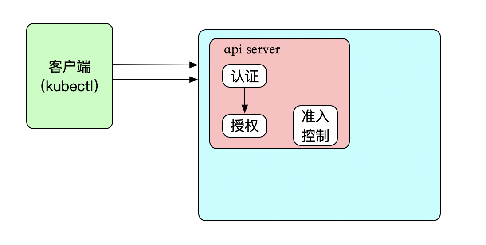
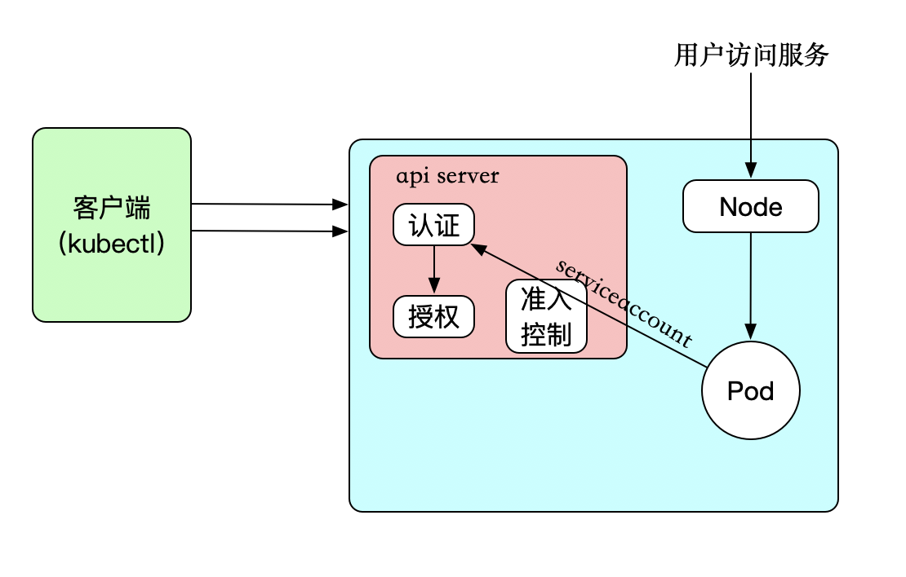

#### 概念
  Service Account为Pod中的进程和外部用户提供身份信息。所有的kubernetes集群中账户分为两类，Kubernetes管理的serviceaccount(服务账户)和useraccount（用户账户）。
  2种类型：1. User Accounts 2. Service Accounts  

#### 访问

##### 用户
  来自集群外部的访问，我们可以理解成是User Account，是给kubernetes集群外部用户，例如（系统管理员、用户/租户等）
  
  
##### pod
  Service Account而是给运行在Pod的容器、或者Pod使用的身份认证。Pod访问Kubernetes Api Server服务时，也是需要身份认证的。如下图：
  
  
  在namespace建立pod时，如果没有特别指定 `spec.serviceAccountName`， k8s会默认使用相同命名空间下的 `default` 的 service account
