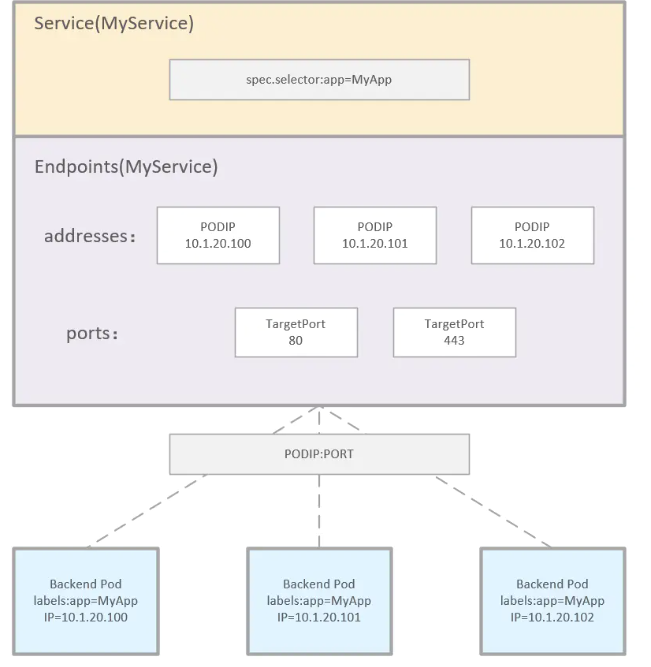
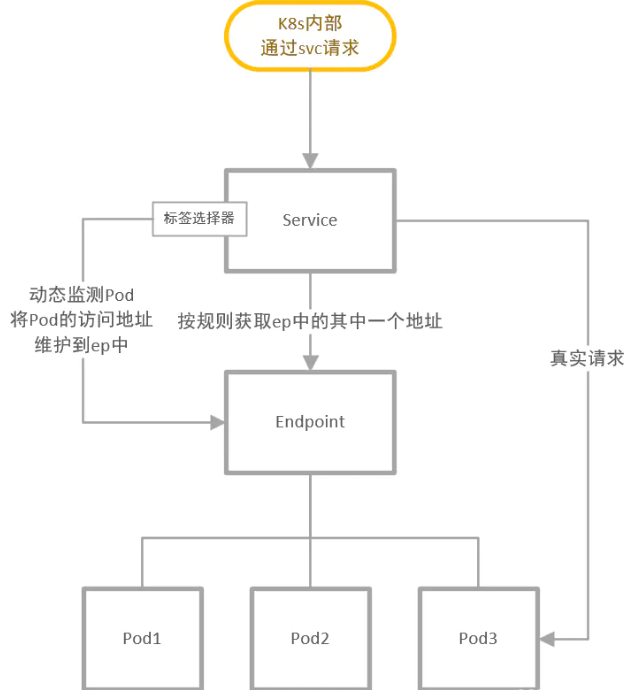
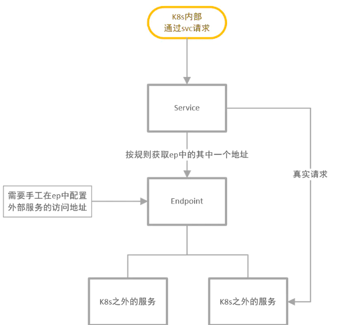

### 概念
&ensp;&ensp;endpoint是k8s集群中的一个资源对象，存储在etcd中，用来记录一个service对应的所有pod的访问地址。
创建service的时候会同时创建一个与service同名的endpoints对象，endpoints与pod实际建立映射
&ensp;&ensp;Service、Endpoint 和 Pod 的关系


&ensp;&ensp;自动关联内部 Pod 服务


&ensp;&ensp;自动关联外部服务


### endpoint controller
- Endpoints Controller就是负责生成和维护所有Endpoints对象的控制器，它负责监听Service和对应的Pod副本的变化。
- 如果检测到Service被删除，则删除和该Service同名的Endpoints对象。
- 如果检测到新的Service被创建或者修改则根据该Service信息获得相关的Pod列表，然后创建或者更新Service对应的Endpoints对象。
```yaml
---
apiVersion: v1
kind: Endpoints
metadata:
  name: webhook-service
  namespace: system
subsets:
  - addresses:
      - ip: <k8s-master-ip>
    ports:
      - port: 9443
```