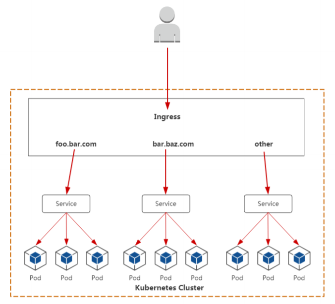

### ingress
&ensp;&ensp;在 K8S 中，服务跟 Pod IP 主要供服务在集群内访问使用，对于集群外的应用是不可见的。怎么解决这个问题呢？
为了让外部的应用能够访问 K8S 集群中的服务，通常解决办法是 NodePort 和 LoadBalancer  

&ensp;&ensp;这两种方案其实有各自的缺点，NodePort 的缺点是一个端口只能挂载一个 Service，而且为了更高的可用性，需要额外搭建一个负载均衡。
LoadBalancer 的缺点则是每个服务都必须要有一个自己的 IP，不论是内网 IP 或者外网 IP。更多情况下，为了保证 LoadBalancer 的能力，
一般需要依赖于云服务商

&ensp;&ensp;于此之外，如果通过<NoteIP>:<NotePort>去访问集群服务的话，如果量一上来，那么也不会有人很清楚的记得是什么<NoteIP>:<NotePort>对应
什么服务，因此需要一个域名来解决该问题

#### 首先service的作用体现在
- 对集群内部，不断跟踪pod的变化，更新endpoint中对应pod的对象，提供了ip不断变化的pod的服务发现机制
- 对集群外部，类似负载均衡器，可以在集群内外部对pod进行访问

#### 暴露服务的方式
- NotePort ： 外网暴露端口 -> app1 selector -> app1, 不足之处：一个端口只能一个服务使用，端口需提前规划, 只支持4层负载均衡
- LoadBalancer : 受限于云平台, 还要收费
- Ingress ： www.app1.com 域名->app1-service->app1 selector->app1

### 理解
&ensp;&ensp;**Ingress 是用于将外部 HTTP（S）流量路由到服务（Service）的规则集合**  
&ensp;&ensp;ingress可以简单理解为service的service，他通过独立的ingress对象来制定请求转发的规则，把请求路由到**一个或多个service中**。
这样就把服务与请求规则解耦了，可以从业务维度统一考虑业务的暴露，而不用为每个service单独考虑.  
&ensp;&ensp;ingress可以根据不同域名、不同path转发请求到不同的service
```yaml
apiVersion: extensions/v1beta1
kind: Ingress
metadata:
  name: abc-ingress
  annotations: 
    kubernetes.io/ingress.class: "nginx"
    nginx.ingress.kubernetes.io/use-regex: "true"
spec:
  tls:
  - hosts:
    - api.abc.com
    secretName: abc-tls
  rules:
  - host: api.abc.com
    http:
      paths:
      - backend:
          serviceName: apiserver
          servicePort: 80
  - host: www.abc.com
    http:
      paths:
      - path: /image/*
        backend:
          serviceName: fileserver
          servicePort: 80
  - host: www.abc.com
    http:
      paths:
      - backend:
          serviceName: feserver
          servicePort: 8080
```

### 图
