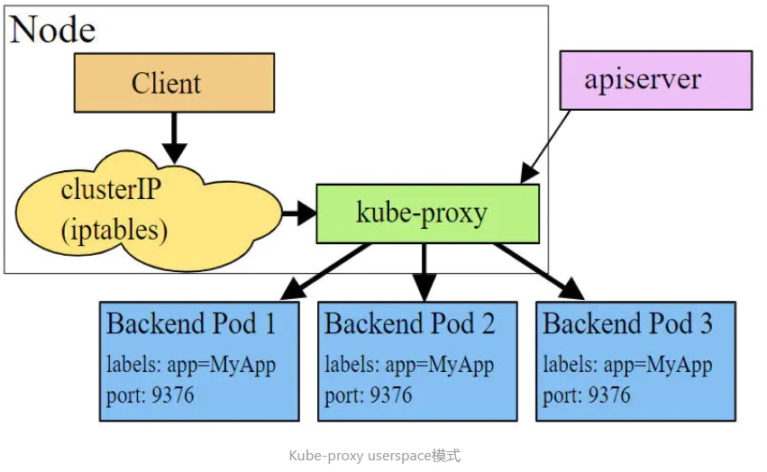
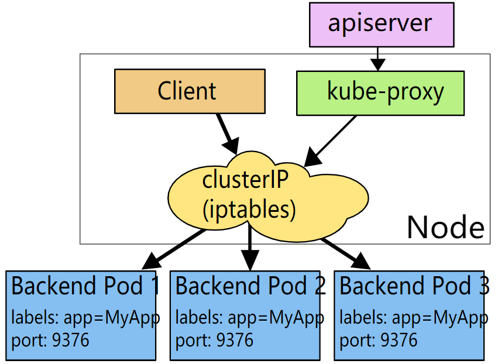
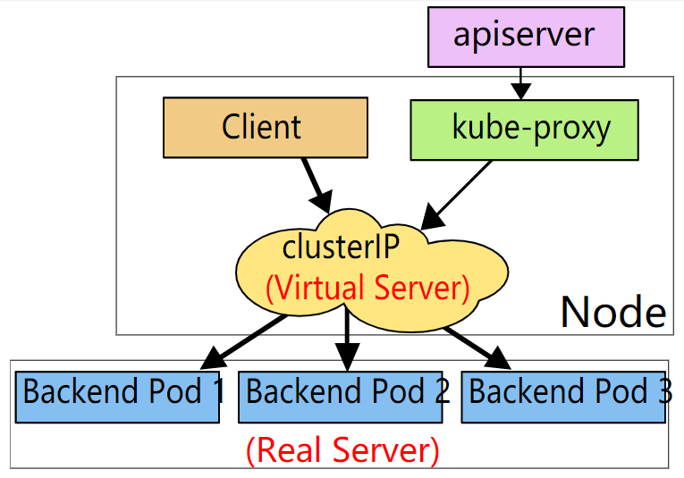

	当Pod宕机后重新生成时，其IP等状态信息可能会变动、不固定，Service会根据Pod的Label对这些状态信息进行监控和变更，保证上游服务不受Pod的变动而影响。因此由于pod的IP是可能变动的，k8s提供了service资源，service会对提供同一个服务的多个pod进行聚合，并且提供一个统一的入口地址。通过访问service的入口地址就能访问到后面的pod服务。

### Service(svc)

​	在 Kubernetes 集群中，每个 Node 运行一个 kube-proxy 进程。kube-proxy 负责为 Service 实现了一种 VIP（虚拟 IP）的形式。

​	每个Node节点上都运行着一个kube-proxy服务进程。当创建Service的时候会通过api-server向etcd写入创建的service的信息，而kube-proxy会基于监听的机制发现这种Service的变动，然后它会将最新的Service信息转换成对应的访问规则。

​	service通过label和slector标签与pod建立关联。

#### 使用场景

- 当客户端想要访问K8S集群中的pod时，需要知道pod的ip以及端口，那K8S中如何在不知道pod的地址信息的情况下进行pod服务的快速连接？

- 若某一node上的pod发生故障，K8S最大的特点就是能够给感知和重启该pod，但是pod重启后ip会发生变化，那么客户端如何感知并保持对pod的访问？

- 如果多个pod组合在一起形成pod组，如何在被访问时达到负载均衡的效果？

#### 具体的作用和场景如下

- 通过Pod的Label Selector访问Pod组。
- Service的IP保持不变（Headless Servcie除外），保证了访问接口的稳定性，屏蔽了Pod的IP地址变化带来的影响，进而实现解耦合。虽然这样，还是建议使用ServiceName进行访问。

#### 工作机制

#### 服务类型

##### ClusterIP

​	通过集群的内部 IP 暴露服务，选择该值时服务只能够在集群内部访问。 这也是默认的 `ServiceType`

##### NodePort

​	通过每个节点上的 IP 和静态端口（`NodePort`）暴露服务。 `NodePort` 服务会路由到自动创建的 `ClusterIP` 服务。 通过请求 `<节点 IP>:<节点端口>`，你可以从集群的外部访问一个 `NodePort` 服务。

##### LoadBalancer

​	使用云提供商的负载均衡器向外部暴露服务。 外部负载均衡器可以将流量路由到自动创建的 `NodePort` 服务和 `ClusterIP` 服务上

##### ExternalName

​	Service的ExternalName方式实现，即设置Service的type为ExternalName。这样做的好处就是内部服务访问外部服务的时候是通过别名来访问的，屏蔽了外部服务的真实信息，外部服务对内部服务透明，外部服务的修改基本上不会影响到内部服务的访问，做到了内部服务和外部服务解耦合。

#### Headless Service

​	有时不需要或不想要负载均衡，以及单独的 Service IP。 遇到这种情况，可以通过指定 Cluster IP（`spec.clusterIP`）的值为 `"None"` 来创建 `Headless` Service。

### kube-proxy的工作模式

#### userspace 模式

​	userspace模式下，kube-proxy会为每一个Service创建一个监听端口，发向Cluster IP的请求被Iptables规则重定向到kube-proxy监听的端口上，kube-proxy根据 round-robin 算法选择一个提供服务的Pod并和其建立链接，以将请求转发到Pod上。

#### iptables 代理模式

​	kube-proxy 会监视 Kubernetes master 对 `Service` 对象和 `Endpoints` 对象的添加和移除。 对每个 `Service`，它会安装 iptables 规则，从而捕获到达该 `Service` 的 `clusterIP`（虚拟 IP）和端口的请求，进而将请求重定向到 `Service` 的一组 backend 中的某个上面。对于每个 `Endpoints` 对象，它也会安装 iptables 规则，这个规则会选择一个 backend `Pod`。

​	和 userspace 代理类似，网络返回的结果是，任何到达 `Service` 的 IP:Port 的请求，都会被代理到一个合适的 backend，不需要客户端知道关于 Kubernetes、`Service`、或 `Pod` 的任何信息。

​	这应该比 userspace 代理更快、更可靠。然而，不像 userspace 代理，如果初始选择的 `Pod` 没有响应，iptables 代理**不能自动地重试**另一个 `Pod`，所以它需要依赖 [readiness probes](https://kubernetes.io/docs/tasks/configure-pod-container/configure-liveness-readiness-probes/#defining-readiness-probes)(就绪探针)。

​	因此可以在使用该模式时，使用就绪探针来查看pod是否正常工作，从而避开不正常的pod。

#### IPVS 代理模式

​	kube-proxy会监视Kubernetes `Service`对象和`Endpoints`，调用`netlink`接口以相应地创建ipvs规则并定期与Kubernetes `Service`对象和`Endpoints`对象同步ipvs规则，以确保ipvs状态与期望一致。访问服务时，流量将被重定向到其中一个后端Pod。

​	与iptables类似，ipvs基于netfilter 的 hook 功能，但使用哈希表作为底层数据结构并在内核空间中工作。这意味着**ipvs可以更快地重定向流量**，并且在同步代理规则时具有更好的性能。此外，ipvs为负载均衡算法提供了更多选项，例如：

- `rr`：轮询调度
- `lc`：最小连接数
- `dh`：目标哈希
- `sh`：源哈希
- `sed`：最短期望延迟
- `nq`： 不排队调度

​	**注意：** ipvs模式假定在运行kube-proxy之前在节点上都已经安装了IPVS内核模块。当kube-proxy以ipvs代理模式启动时，kube-proxy将验证节点上是否安装了IPVS模块，如果未安装，则kube-proxy将回退到iptables代理模式。

