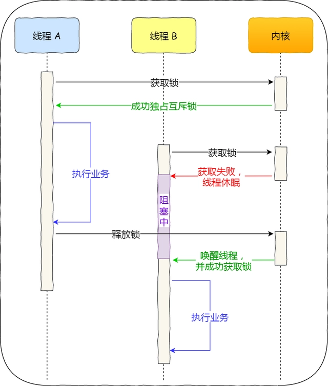

### 两者区别和应用
&ensp;&ensp;加锁的目的就是保证共享资源在任意时间里，只有一个线程访问，这样就可以避免多线程导致共享数据错乱的问题。
&ensp;&ensp;当已经有一个线程加锁后，其他线程加锁则就会失败，互斥锁和自旋锁对于加锁失败后的处理方式是不一样的：
- 互斥锁加锁失败后，线程会释放 CPU ，给其他线程；
- 自旋锁加锁失败后，线程会忙等待，直到它拿到锁

&ensp;&ensp;互斥锁是一种「独占锁」，比如当线程 A 加锁成功后，此时互斥锁已经被线程 A 独占了，
只要线程 A 没有释放手中的锁，线程 B 加锁就会失败，于是就会释放 CPU 让给其他线程，
既然线程 B 释放掉了 CPU，自然线程 B 加锁的代码就会被阻塞。

&ensp;&ensp;对于互斥锁加锁失败而阻塞的现象，是由操作系统内核实现的。当加锁失败时，内核会将线程置为「睡眠」状态，
等到锁被释放后，内核会在合适的时机唤醒线程，当这个线程成功获取到锁后，于是就可以继续执行




&ensp;&ensp;注意：这样下来，开销成本就是两次线程上下文切换的成本。（要联想到用户态、内核态）
- 当线程加锁失败时，内核会把线程的状态从「运行」状态设置为「睡眠」状态，然后把 CPU 切换给其他线程运行
- 接着，当锁被释放时，之前「睡眠」状态的线程会变为「就绪」状态，然后内核会在合适的时间，把 CPU 切换给该线程运行

&ensp;&ensp;**因此能确定被锁住的代码执行时间很短，就不应该用互斥锁，而应该选用自旋锁，否则使用互斥锁**
#### 线程的上下文切换
当两个线程是属于同一个进程，因为虚拟内存是共享的，所以在切换时，虚拟内存这些资源就保持不动，只需要切换线程的私有数据、寄存器等不共享的数据

### 互斥锁
#### 定义
&ensp;&ensp;简单来说就是，只要是操作数据，不论是读还是写，必须先加锁再操作。因此也属于悲观锁的一种

#### go里面的实现过程
1. mutex结构
    ```go
    type Mutex struct {
        state int32 //表示互斥锁的状态，好比是否被锁定等
        sema  uint32 //表示信号量，协程阻塞等待该信号量，解锁的协程释放信号量从而唤醒等待信号量的协程
    }
    ```
2. Mutex.state含有字段 
   + Waiter: 表示阻塞等待锁的线程个数，线程解锁时根据此值来判断是否须要释放信号量
   + Starving：饥饿状态， 0：表示正常状态，1：表示饥饿状态，说明有线程阻塞了超过1ms
   + Woken: 唤醒状态，0：表示未唤醒 1：表示已唤醒，正在加锁过程当中
   + Locked: 加锁状态，0：表示为加锁1：表示已加锁
3. Waiter和Locked  
   获取锁成功Locked=1， 获取失败Waiter++
4. Starving和Woken
   + Woken状态 ：Woken 状态用于加锁和解锁过程的通讯，举个例子，同一时刻，两个线程一个在加锁，一个在解锁，在加锁的协程可能在自旋过程当中，此时把 Woken 标记为1，用于通知解锁线程没必要释放信号量了
   + Starving状态：  
     &ensp;&ensp;自旋过程当中能抢到锁，必定意味着同一时刻有线程释放了锁，释放锁时若是
   发现有阻塞等待的协程。还会释放一个信号量来唤醒一个等待线程，被唤醒的线程获得 CPU 后开始运行，
   此时发现锁已被抢占了，本身只好再次阻塞，不过阻塞前会判断自上次阻塞到本次阻塞通过了多长时间，
   若是超过1ms的话，会将Mutex标记为"饥饿"模式，而后再阻塞。  
     &ensp;&ensp;处于饥饿模式下，不会启动自旋过程，也即一旦有线程释放了锁，那么必定会唤醒其他线程，
   处于饥饿模式下的线程将会优先获取锁，同时也会把等待计数减1。

### 自旋锁
#### 定义
&ensp;&ensp;当一个线程尝试去获取某一把锁的时候，如果这个锁此时已经被别的线程占用，那么此线程就无法获取到这把锁，该线程将会等待，间隔一小段时间后会再次尝试获取。
这种采用循环加锁 -> 等待的机制被称为自旋锁(spinlock)。


参考链接：https://baijiahao.baidu.com/s?id=1678252166115910894&wfr=spider&for=pc