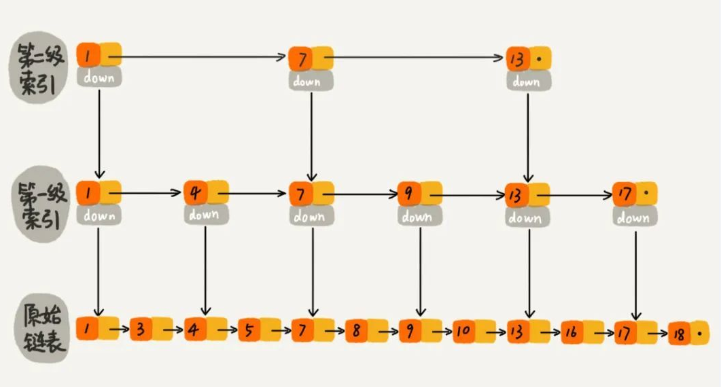

### 数据类型

#### String（字符串）

​	string 是 redis 最基本的类型，你可以理解成与 Memcached 一模一样的类型，一个 key 对应一个 value。

​	string 类型是二进制安全的。意思是 redis 的 string 可以包含任何数据。比如jpg图片或者序列化的对象。

​	string 类型是 Redis 最基本的数据类型，string 类型的值（一个键）最大能存储 512MB。

```
redis 127.0.0.1:6379> SET r "1"
OK
redis 127.0.0.1:6379> GET r
1
```

#### Hash(哈希)

Redis hash 是一个键值(key=>value)对集合。

Redis hash 是一个 string 类型的 field 和 value 的映射表，hash 特别适合用于存储对象。

```
redis 127.0.0.1:6379> HMSET runoob field1 "Hello" field2 "World"
"OK"
redis 127.0.0.1:6379> HGET runoob field1
"Hello"
redis 127.0.0.1:6379> HGET runoob field2
"World"
```

每个 hash 可以存储 2^32 -1 键值对（40多亿）

#### List（列表）

Redis 列表是简单的字符串列表，按照插入顺序排序。你可以添加一个元素到列表的头部（左边）或者尾部（右边）

```
redis 127.0.0.1:6379> lpush runoob redis
(integer) 1
redis 127.0.0.1:6379> lpush runoob mongodb
(integer) 2
redis 127.0.0.1:6379> lpush runoob rabbitmq
(integer) 3
redis 127.0.0.1:6379> lrange runoob 0 10
1) "rabbitmq"
2) "mongodb"
3) "redis"
redis 127.0.0.1:6379>
```

列表最多可存储 2^32 - 1 元素 (4294967295, 每个列表可存储40多亿)

#### Set（集合）

Redis 的 Set 是 string 类型的无序集合。

集合set是通过哈希表实现的，所以添加，删除，查找的复杂度都是 O(1)。

##### sadd 命令

添加一个 string 元素到 key 对应的 set 集合中，成功返回 1，如果元素已经在集合中返回 0。

```
sadd key member
```

```
redis 127.0.0.1:6379> sadd runoob redis
(integer) 1
redis 127.0.0.1:6379> sadd runoob mongodb
(integer) 1
redis 127.0.0.1:6379> sadd runoob rabbitmq
(integer) 1
redis 127.0.0.1:6379> sadd runoob rabbitmq
(integer) 0
redis 127.0.0.1:6379> smembers runoob

1) "redis"
2) "rabbitmq"
3) "mongodb"
```

**注意：**以上实例中 rabbitmq 添加了两次，但根据**集合内元素的唯一性**，第二次插入的元素将被忽略。

集合中最大的成员数为 2^32 - 1(4294967295, 每个集合可存储40多亿个成员)。

#### zset(sorted set：有序集合)

Redis zset 和 set 一样也是string类型元素的集合,且不允许重复的成员。

不同的是每个元素都会关联一个double类型的分数。redis正是通过分数来为集合中的成员进行从小到大的排序。

zset的成员是唯一的,但分数(score)却可以重复

##### zadd 命令

添加元素到集合，元素在集合中存在则更新对应score

```
zadd key score member 
```

```
redis 127.0.0.1:6379> zadd runoob 0 redis
(integer) 1
redis 127.0.0.1:6379> zadd runoob 0 mongodb
(integer) 1
redis 127.0.0.1:6379> zadd runoob 0 rabbitmq
(integer) 1
redis 127.0.0.1:6379> zadd runoob 0 rabbitmq
(integer) 0
redis 127.0.0.1:6379> ZRANGEBYSCORE runoob 0 1000
1) "mongodb"
2) "rabbitmq"
3) "redis"
```

##### 跳跃表



跳跃表（skiplist）是一种有序数据结构，它通过在每个节点中维持多个指向其它节点的指针，从而达到快速访问节点的目的。

###### 时间复杂度

​	如果一个链表有 n 个结点，如果每两个结点抽取出一个结点建立索引的话，那么级索引的结点数大约就是 n/2，第二级索引的结点数大约为 n/4，以此类推第 m 级索引的节点数大约为
$$
n/(2^m)
$$
​	查询跳表的时候，如果每一层都需要遍历 k 个结点，那么时间复杂度就为
$$
O(k * log(n))
$$
​	K为常数，时间复杂度就为
$$
O(log(n))
$$
​	

###### 空间复杂度

空间复杂度就是每层节点和
$$
O(n)
$$


###### 为什么选择跳跃表

1. 普通 BST 插入元素越有序效率越低，最坏情况会退化回链表
2. 平衡树的插入和删除操作可能引发子树的调整平衡过程比较复杂，实现起来麻烦（如AVL树需要LL、LR、RL、RR四种旋转操作保持平衡，红黑树则需要左旋、右旋和节点变色三种操作），而skiplist的插入和删除只需要修改相邻节点的指针，操作简单又快速。
3. 实现简单

###### 查找

​	假设要查找的数据为x，同时每2个节点抽出来作为索引，在第 k 级索引中，遍历到 y节点之后，发现 x 大于 y，小于后面的节点 z，所以通过 y 的 down 指针，从第 k 级索引下降到第 k-1 级索引。在第 k-1 级索引中，y 和 z 之间只有 3 个节点（包含 y 和 z），所以，在 k-1 级索引中最多只需要遍历 3 个结点，依次类推，每一级索引都最多只需要遍历 3 个节点。

#### Stream
Redis Stream 是 Redis 5.0 版本新增加的数据结构。

Redis Stream 主要用于消息队列（MQ，Message Queue），Redis 本身是有一个 Redis 发布订阅 (pub/sub) 来实现消息队列的功能，但它有个缺点就是消息无法持久化，如果出现网络断开、Redis 宕机等，消息就会被丢弃。

简单来说发布订阅 (pub/sub) 可以分发消息，但无法记录历史消息

而 Redis Stream 提供了消息的持久化和主备复制功能，可以让任何客户端访问任何时刻的数据，并且能记住每一个客户端的访问位置，还能保证消息不丢失。

url: https://www.runoob.com/redis/redis-stream.html

#### Bitmap

位图，可以认为是一个以位为单位数组，数组中的每个单元只能存 0 或者 1，数组的下标在 Bitmap 中叫做偏移量。Bitmap 的长度与集合中元素个数无关，而是与基数的上限有关

#### Hyperloglog

HyperLogLog 是用来做基数统计的算法，其优点是，在输入元素的数量或者体积非常非常大时，计算基数所需的空间总是固定的、并且是很小的。典型的使用场景是统计独立访客。

##### 什么是基数?
比如数据集 {1, 3, 5, 7, 5, 7, 8}， 那么这个数据集的基数集为 {1, 3, 5 ,7, 8}, 基数(不重复元素)为5。 基数估计就是在误差可接受的范围内，快速计算基数。

#### redis GEO
Redis GEO 主要用于存储地理位置信息，并对存储的信息进行操作，该功能在 Redis 3.2 版本新增。

Redis GEO 操作方法有：

1. geoadd：添加地理位置的坐标。 
2. geopos：获取地理位置的坐标。 
3. geodist：计算两个位置之间的距离。 
4. georadius：根据用户给定的经纬度坐标来获取指定范围内的地理位置集合。 
5. georadiusbymember：根据储存在位置集合里面的某个地点获取指定范围内的地理位置集合。 
6. geohash：返回一个或多个位置对象的 geohash 值。

### 命令

### 缓存穿透

​	当用户访问的数据，**既不在缓存中，也不在数据库中**，导致请求在访问缓存时，发现缓存缺失，再去访问数据库时，发现数据库中也没有要访问的数据，没办法构建缓存数据，来服务后续的请求。

#### 解决方案

1. 当查找一个不在数据库/redis里面的数据时，设置一个空值，后续查询直接返回空值
2. 布隆过滤器：在数据写入数据库的同时将这个 ID 同步到到布隆过滤器中，当请求的 id 不存在布隆过滤器中则说明该请求查询的数据一定没有在数据库中保存，就不要去数据库查询了。

### 缓存击穿

​	缓存中的**某个热点数据过期**了，此时大量的请求访问了该热点数据，就无法从缓存中读取，直接访问数据库，数据库很容易就被高并发的请求冲垮

#### 解决方案

1. 设置过期时间+随机时间，
2. 加锁，保证只有一个请求去读取数据并加载到redis
3. 提前把热点数据存入redis中

### 缓存雪崩

​	当**大量缓存数据在同一时间过期（失效）或者 Redis 故障宕机**时，如果此时有大量的用户请求，都无法在 Redis 中处理，于是全部请求都直接访问数据库，从而导致数据库的压力骤增，严重的会造成数据库宕机，从而形成一系列连锁反应，造成整个系统崩溃

#### 解决方案

1. 过期时间添加随机值，确保不会同一时刻热点数据全部失效
2. 接口限流

### Redis的过期键的删除策略
1. 定时过期：每个设置过期时间的key都需要创建一个定时器，到过期时间就会立即清除。该策略可以立即清除过期的数据，对内存很友好；但是会占用大量的CPU资源去处理过期的数据，从而影响缓存的响应时间和吞吐量。 
2. 惰性过期：只有当访问一个key时，才会判断该key是否已过期，过期则清除。该策略可以最大化地节省CPU资源，却对内存非常不友好。极端情况可能出现大量的过期key没有再次被访问，从而不会被清除，占用大量内存。 
3. 定期过期：每隔一定的时间，会扫描一定数量的数据库的expires字典中一定数量的key，并清除其中已过期的key。该策略是前两者的一个折中方案。通过调整定时扫描的时间间隔和每次扫描的限定耗时，可以在不同情况下使得CPU和内存资源达到最优的平衡效果。

### 8种内存淘汰策略
redis内存满了..... 
1. noeviction：直接返回错误，不淘汰任何已经存在的redis键
2. allkeys-lru：所有的键使用lru算法进行淘汰
3. volatile-lru：有过期时间的使用lru算法进行淘汰
4. allkeys-random：随机删除redis键
5. volatile-random：随机删除有过期时间的redis键
6. volatile-ttl：删除快过期的redis键
7. volatile-lfu：根据lfu算法从有过期时间的键删除
8. allkeys-lfu：根据lfu算法从所有键删除
