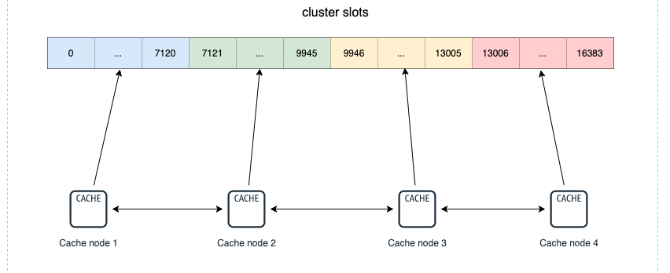
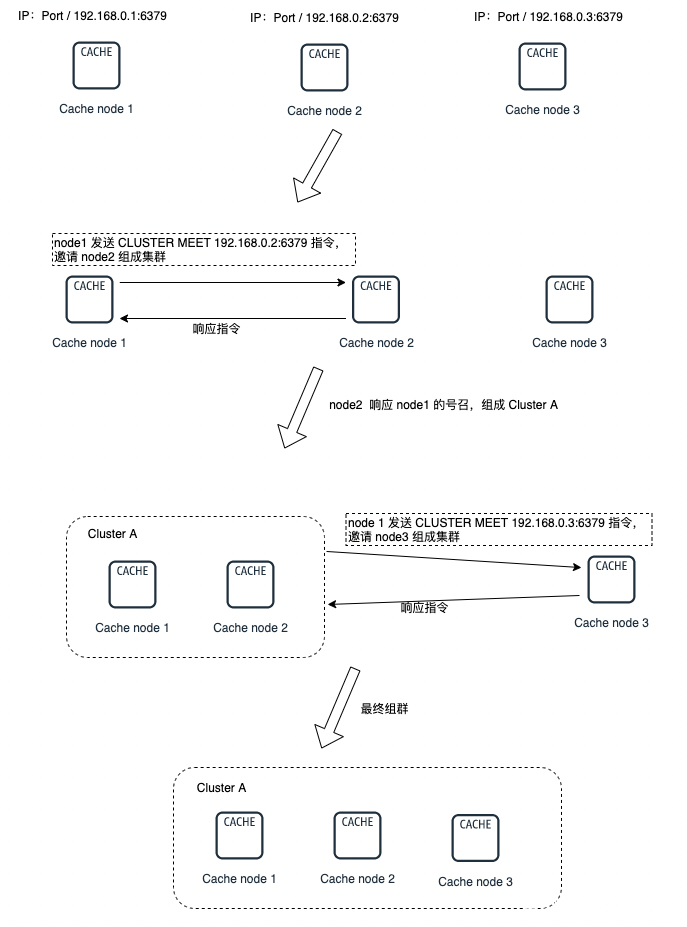
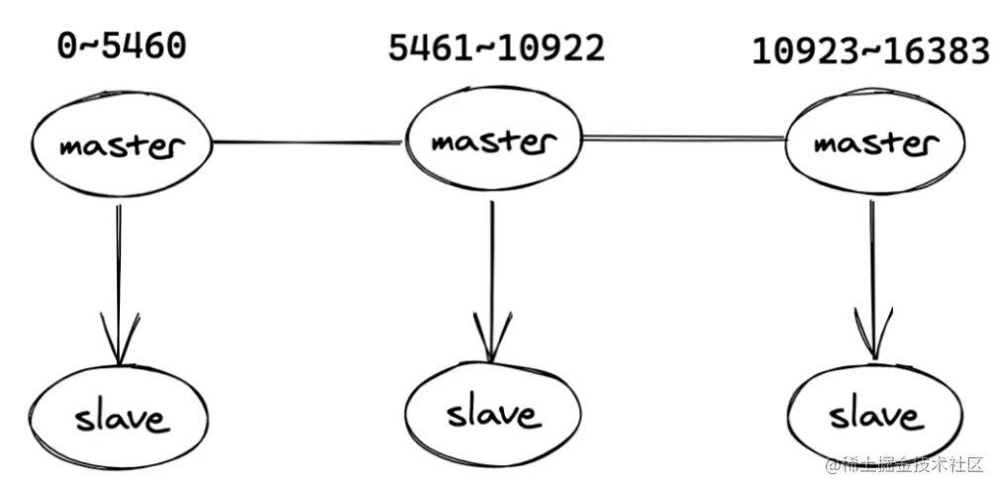

## cluster集群

Cluster 即 集群模式，类似MySQL，Redis 集群也是一种分布式数据库方案，集群通过分片（sharding）模式来对数据进行管理，并具备分片间数据复制、故障转移和流量调度的能力。

Redis集群的做法是 将数据划分为 16384（2的14次方）个哈希槽（slots），如果你有多个实例节点，那么每个实例节点将管理其中一部分的槽位，槽位的信息会存储在各自所归属的节点中。

以下图为例，该集群有4个 Redis 节点，每个节点负责集群中的一部分数据，数据量可以不均匀。比如性能好的实例节点可以多分担一些压力。


一个Redis集群一共有16384个哈希槽，你可以有1 ~ n个节点来分配这些哈希槽，可以不均匀分配，每个节点可以处理0个 到至多 16384 个槽点。
当16384个哈希槽都有节点进行管理的时候，集群处于online 状态。同样的，如果有一个哈希槽没有被管理到，那么集群处于offline状态。

上面图中4个实例节点组成了一个集群，集群之间的信息通过 Gossip协议 进行交互，这样就可以在某一节点记录其他节点的哈希槽（slots）的分配情况。

## 为什么需要cluster
  单机的吞吐无法承受持续扩增的流量的时候，最好的办法是从横向（scale out） 和 纵向（scale up）两方面进行扩展
  
1. 纵向扩展（scale up）：将单个实例的硬件资源做提升，比如 CPU核数量、内存容量、SSD容量。 
2. 横向扩展（scale out）（分片）：横向扩增 Redis 实例数，这样每个节点只负责一部分数据就可以，分担一下压力，典型的分治思维。
  
## 组成原理
  各个节点的联通是通过 CLUSTER MEET 命令完成的：  
  `CLUSTER MEET <ip> <port>`  
  
  

## 集群数据分片原理
集群分片的做法，主要是使用了官方提供的 Redis Cluster 方案。这种方案就是的核心就是集群的实例节点与哈希槽（slots）之间的划分、映射与管理。  

### 哈希槽（slots）的划分
slots 与 Redis Key 的映射是通过以下两个步骤完成的：
1. 使用 CRC16 算法计算键值对信息的Key，会得出一个 16 bit 的值。 
2. 将 第1步 中得到的 16 bit 的值对 16384 取模，得到的值会在 0 ～ 16383 之间，映射到对应到哈希槽中。

在一些特殊的情况下，你想把某些key固定到某个slot上面，也就是同一个实例节点上。这时候可以用hash tag能力，强制 key 所归属的槽位等于 tag 所在的槽位。  
实现方式为在key中加个{}，例如test_key{1}。使用hash tag后客户端在计算key的crc16时，只计算{}中数据。如果没使用hash tag，客户端会对整个key进行crc16计算。  
```
127.0.0.1:6380> cluster keyslot user:case
(integer) 9491
127.0.0.1:6380> cluster keyslot user:case{1}
(integer) 9842
```
hash tag 缺点： 可能会导致数据集中在一个实例中，造成数据倾斜  

### 哈希槽（slots）的映射
2种方法:
1. 初始化的时候均匀分配 ，使用 cluster create 创建，会将 16384 个slots 平均分配在我们的集群实例上，比如你有n个节点，那每个节点的槽位就是 16384 / n 个了 。
2. 通过 CLUSTER MEET 命令将 node1、node2、ndoe3、node4 4个节点联通成一个集群，刚联通的时候因为还没分配哈希槽，还是处于offline状态。我们使用 cluster addslots 命令来指定。
指定的好处就是性能好的实例节点可以多分担一些压力。  
```
redis-node-1 : redis-cli -h 192.168.0.1 –p 6379 cluster addslots 0,7120
redis-node-2 : redis-cli -h 192.168.0.2 –p 6379 cluster addslots 7121,9945
redis-node-3 : redis-cli -h 192.168.0.3 –p 6379 cluster addslots 9946,13005
redis-node-4 : redis-cli -h 192.168.0.4 –p 6379 cluster addslots 13006,16383
```

## 数据复制过程和故障转移
Cluster 是具备Master 和 Slave模式, 还具备哨兵模式

## 定位数据所在节点
过程:  
1. 客户端连接任一实例，获取到slots与实例节点的映射关系，并将该映射关系的信息缓存在本地。 
2. 将需要访问的redis信息的key，经过CRC16计算后，再对16384 取模得到对应的 Slot 索引。 
3. 通过slot的位置进一步定位到具体所在的实例，再将请求发送到对应的实例上

