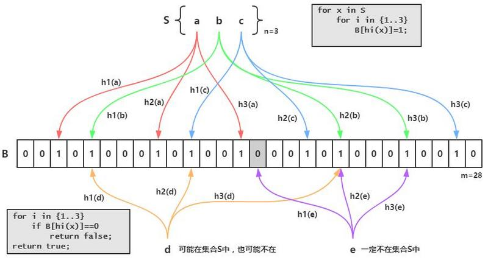

## 概念
布隆过滤器（Bloom Filter）是一种数据结构，用于快速检查一个元素是否属于某个集合中。它可以快速判断一个元素是否在一个大型集合中，且判断速度很快且不占用太多内存空间。

布隆过滤器的主要原理是使用一组哈希函数，将元素映射成一组位数组中的索引位置。即：当要插入一个元素时，将其数据分别输入k个哈希函数，产生k个哈希值。以哈希值作为位数组中的下标，将所有k个对应的比特置为1。  
当要检查一个元素是否在集合中时，将该元素进行哈希处理，然后查看哈希值对应的位数组的值是否为1。  
如果哈希值对应的位数组的值都为1，那么这个元素可能在集合中，否则这个元素肯定不在集合中，这种情况称为“假阳性”（false positive）

由于哈希函数的映射可能会发生冲突，因此布隆过滤器可能会出现误判，即把不在集合中的元素判断为在集合中。但是，布隆过滤器不会漏判，即不会把在集合中的元素判断为不在集合中。

由于布隆过滤器可能会出现误判，因此在实际应用中，需要根据具体的应用场景来确定误判率的可接受范围，并相应地设置哈希函数数量和位数组大小。同时，需要注意，布隆过滤器无法删除已添加的数据。

   Redis实现布隆过滤器的底层就是通过bitmap这种数据结构

如图所示，S 集合中有 n 个元素，利用 k 个哈希函数，将 S 中的每个元素映射到一个长度为 m 的位(bit) 数组 B 中的不同位置上，这些位置上的二进制数均置为 1，如果待检测的元素经过这 k 个哈希函数的映射后，
发现其 k 个位置哈希的二进制数不全是 1，那么这个元素一定不在集合 S 中，反之该元素可能是 S 中的某一个元素。

## 假阳性

在哈希函数的个数k一定的情况下：
1. 位数组长度m越大，假阳性率越低；
2. 已插入元素的个数n越大，假阳性率越高

## 优缺点
优点：
1. 时间和空间效率高：布隆过滤器的时间复杂度和空间复杂度都是O(k)，其中k为哈希函数的数量。因此，它可以在较小的空间内快速判断某个元素是否在集合中。
2. 误判率低：布隆过滤器虽然可能出现误判，但是误判率可以通过调整哈希函数数量和位数组大小来控制，可以根据实际需求进行调整。
3. 支持高并发：布隆过滤器支持并发查询和添加数据，可以在多线程环境下使用。
4. 易于实现：布隆过滤器的实现比较简单，只需要实现几个哈希函数和一个位数组即可。

缺点：
1. 无法删除已添加的数据：由于布隆过滤器的哈希函数不具有逆向性，所以无法删除已添加的数据。
2. 误判率无法避免：由于布隆过滤器的设计原理，误判率无法避免。当哈希函数的数量不足或位数组的大小不够时，误判率可能会很高。
3. 无法精确判断元素是否存在：由于布隆过滤器的设计原理，无法精确判断某个元素是否在集合中，只能判断它可能存在或一定不存在。

## 少布隆过滤器的误判
布隆过滤器的误判率是根据`哈希函数的数量`和`位数组大小`来确定的。如果哈希函数的数量太少或者位数组太小，那么误判率会增加。反之，如果哈希函数的数量太多或者位数组太大，那么可能会导致空间浪费和查询效率降低。
因此，在实际使用中，需要根据具体的应用场景来确定哈希函数数量和位数组大小，以达到误判率和空间利用率的平衡。

除了调整哈希函数数量和位数组大小之外，还可以采用以下方法来减少布隆过滤器的误判率：

1. 使用多个布隆过滤器：将同一个元素添加到多个布隆过滤器中，查询时需要在所有布隆过滤器中查询。这种方法可以显著降低误判率，但是会增加存储空间和查询时间。
2. 使用加密哈希函数：加密哈希函数可以使哈希值更难以预测，从而减少哈希冲突的概率。常见的加密哈希函数包括MD5、SHA-1等。
3. 使用高质量的哈希函数：使用高质量的哈希函数可以减少哈希冲突的概率。常见的高质量哈希函数包括MurmurHash、CityHash等。
4. 对于数据量较小的情况，可以使用简单的线性查找代替布隆过滤器，这样可以避免误判率过高的问题。

需要注意的是，误判率是布隆过滤器的本质限制，无法完全避免。因此，在使用布隆过滤器时，需要根据实际需求来平衡误判率和空间利用率，同时采用多个布隆过滤器、使用高质量的哈希函数等方法来尽量减少误判率。

## 使用场景
1. 缓存
2. 数据去重
3. 可以用来减少数据库查询。在实际操作中，可以将数据库中的所有关键字放入布隆过滤器中。每当需要查询某个关键字时，先查询布隆过滤器。如果查询结果表明该关键字不存在，就可以直接返回查询结果为空，无需进行数据库的访问。如果查询结果表明该关键字存在，就需要进行数据库的访问，查询具体的数据
4. 可以用来快速地判断某个元素是否在分布式系统中。
   - 在实际操作中，每个节点都可以维护一个布隆过滤器。当需要查询某个元素是否在分布式系统中时，可以将查询请求发送到所有节点，并在每个节点上查询布隆过滤器。如果查询结果表明该元素存在于任意一个节点中，就可以直接返回查询结果为真

## go-zero中的bloom filter源码分析

详情见bloom.go
