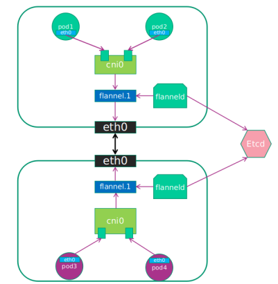
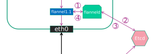
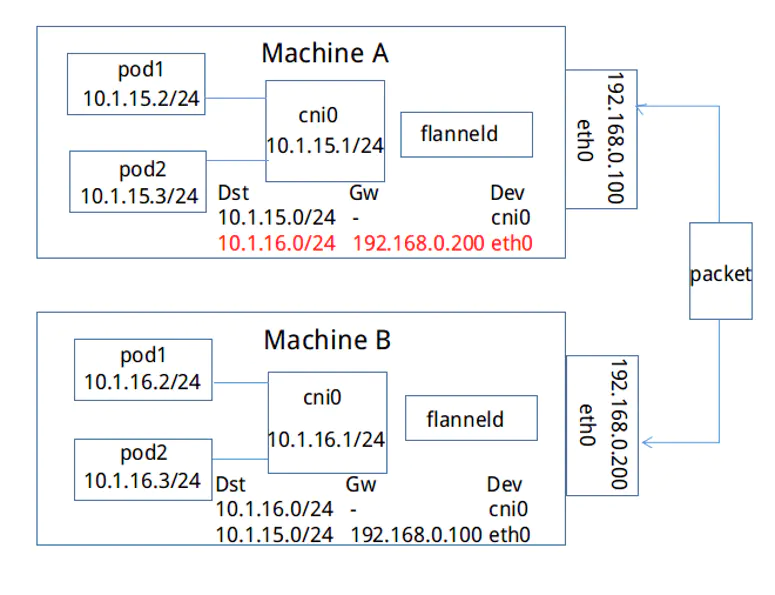
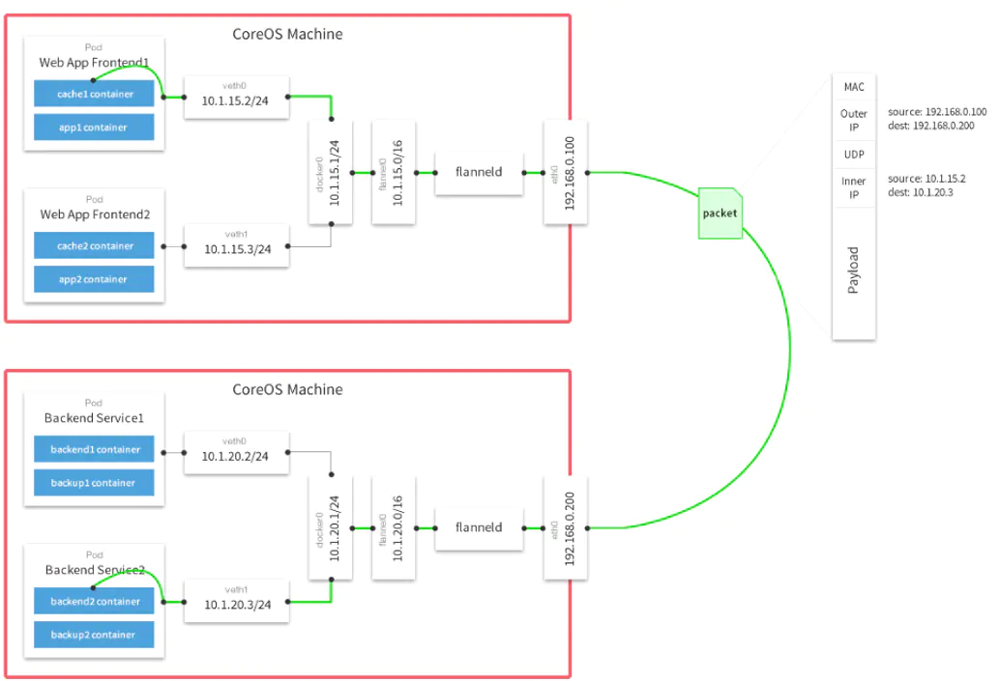

## 概念
在默认的docker配置中，不同节点上docker服务可能会给其节点上的容器分配相同的IP地址

而flannel的目的便是为集群中的所有节点重新规划 IP 地址的使用规则，从而使得不同节点上的容器能够获得`同属一个内网`且`不重复的` IP 地址，并让属于不同节点上的容器能够直接通过内网 IP 通信。

Flannel 实质上是一种“覆盖网络(overlaynetwork)”，也就是将 TCP 数据包装在另一种网络包里面进行路由转发和通信

## 所支持的backend
1. udp：使用用户态udp封装，默认使用8285端口。由于是在用户态封装和解包，性能上有较大的损失
2. vxlan：vxlan封装，需要配置VNI，Port（默认8472）和GBP
3. host-gw：直接路由的方式，将容器网络的路由信息直接更新到主机的路由表中，仅适用于二层直接可达的网络
4. aws-vpc：使用 Amazon VPC route table 创建路由，适用于AWS上运行的容器
5. gce：使用Google Compute Engine Network创建路由，所有instance需要开启IP forwarding，适用于GCE上运行的容器
6. ali-vpc：使用阿里云VPC route table 创建路由，适用于阿里云上运行的容器

## 架构图

flanneld: 与etcd同步本机和其他宿主机的子网信息，向其宿主机的路由表添加相应的路由规则, 封装相应的数据包
Flannel.1: linux网络设备(TUN/TAP设备、VTEP设备等)，pod流量经该设备流入flanneld，最后由flanneld封装数据包在由该设备流出

### 流程
1. pod中产生数据，根据pod的路由信息，将数据发送到Cni0
2. Cni0 根据节点的路由表，将数据发送到`隧道设备flannel.1`
3. 隧道设备Flannel.1 将数据包转发给flanneld，flanneld从etcd，获得对端隧道设备的必要信息,同时flanneld向其宿主机的路由表添加相应的路由规则并且封装数据包。
4. 隧道设备Flannel.1将数据包发送到对端设备。对端节点接收到数据包，flanneld发现数据包为overlay数据包，解开外层封装，并发送内层封装到flannel.1设备。
5. 隧道设备Flannel.1设备查看数据包，根据路由表匹配，将数据发送给本机的Cni0设备。
6. Cni0匹配路由表，发送数据给网桥上对应的端口。

## 常见的backend

### hostgw
flanneld 从 etcd 中监听到一个  subnet 为 10.1.15.0/24 被分配给主机 Public IP 192.168.0.100 的 EventAdded 事件 之后，
hostgw 会在本主机上添加一条目的地址为 10.1.15.0/24，网关地址为 192.168.0.100，
对于 EventRemoved 事件，只需删除对应的路由。

缺点：要求所有的pod都在一个子网中，如果跨网段就无法通信。

### UDP

当容器10.1.15.2/24要和容器10.1.20.2/24通信时，

1. 因为该封包的目的地不在本主机subnet内，因此封包会首先通过网桥转发到主机中。
2. 在主机上经过路由匹配，进入网卡flannel。(需要注意的是flannel是一个tun设备，它是一种工作在三层的虚拟网络设备，而flanneld是一个proxy，它会监听flannel并转发流量。)
3. 当封包进入flannel时，flanneld就可以从flanne中将封包读出，由于flanne是三层设备，所以读出的封包仅仅包含IP层的报头及其负载。
4. 最后flanneld会将获取的封包作为负载数据，通过udp socket发往目的主机。
5. 在目的主机的flanneld会监听Public IP所在的设备，从中读取udp封包的负载，并将其放入flannel设备内。
6. 容器网络封包到达目的主机，之后就可以通过网桥转发到目的容器了。

### vxlan

vxlan和上文提到的udp backend的封包结构是非常类似的，不同之处是多了一个vxlan header，以及原始报文中多了个二层的报头

当初始化集群里，vxlan网络的初始化工作：

主机B加入flannel网络时,它会将自己的三个信息写入etcd中，分别是：subnet 10.1.16.0/24、Public IP 192.168.0.101、vtep设备flannel.1的mac地址 MAC B。之后，主机A会得到EventAdded事件，并从中获取上文中B添加至etcd的各种信息。这个时候，它会在本机上添加三条信息：

1) 路由信息：所有通往目的地址10.1.16.0/24的封包都通过vtep设备flannel.1设备发出，发往的网关地址为10.1.16.0，即主机B中的flannel.1设备。

2) fdb信息：MAC地址为MAC B的封包，都将通过vxlan发往目的地址192.168.0.101，即主机B

3) arp信息：网关地址10.1.16.0的地址为MAC B