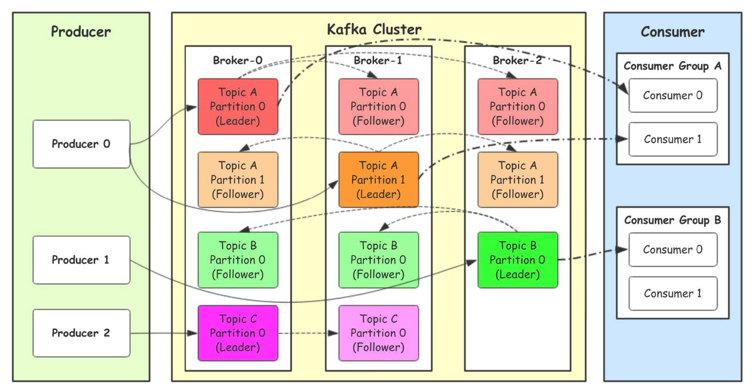
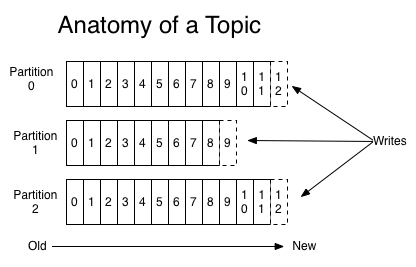
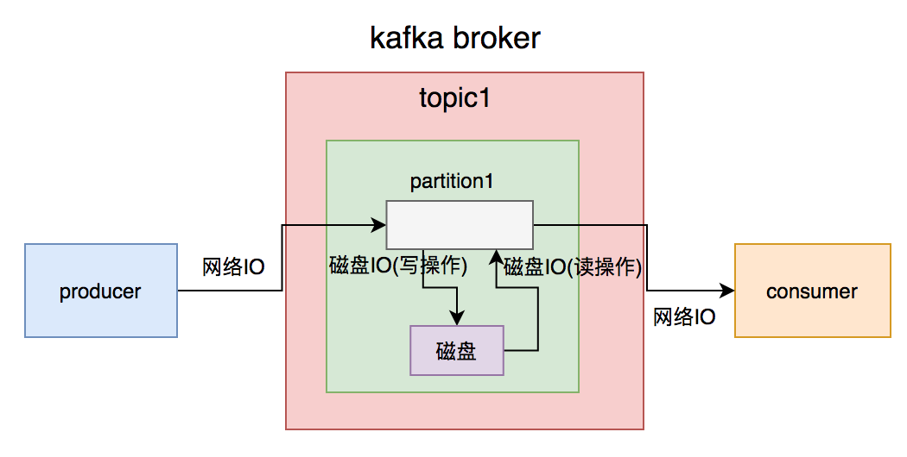
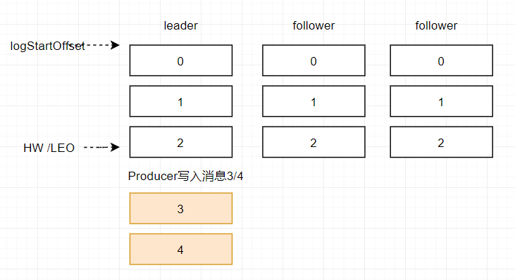
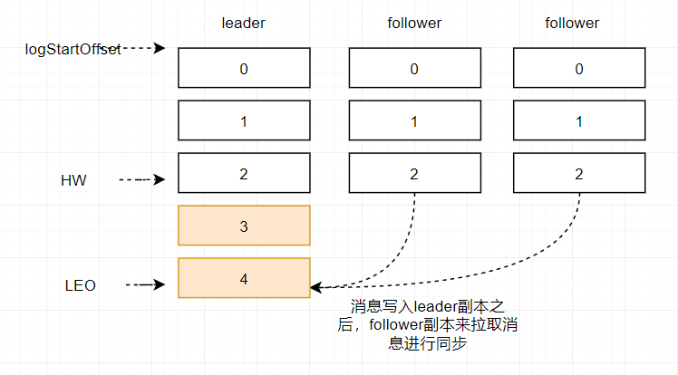
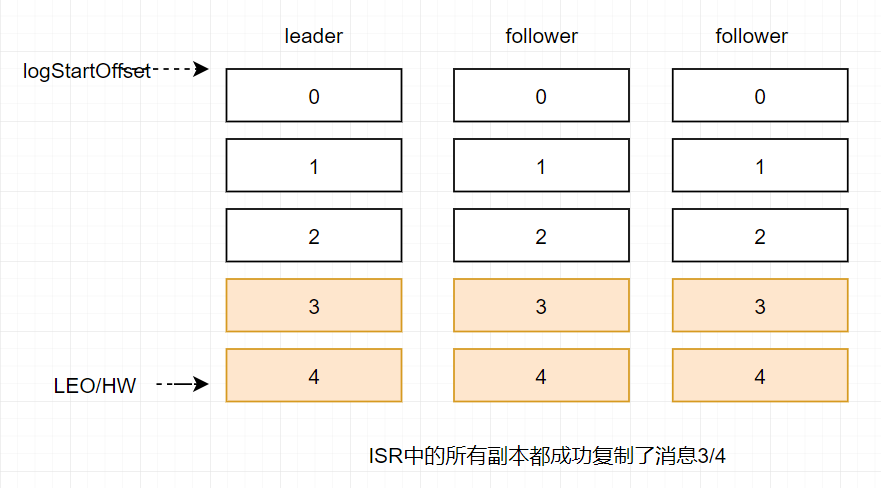
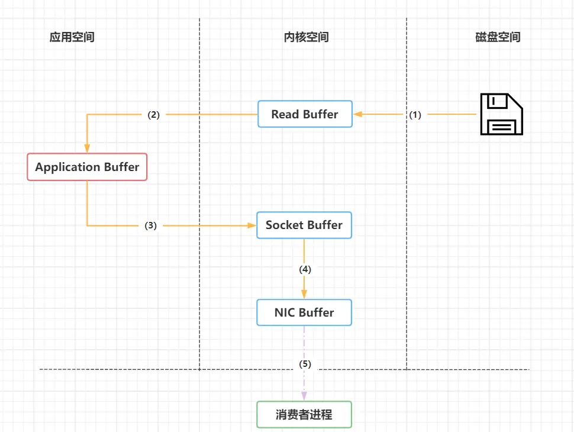
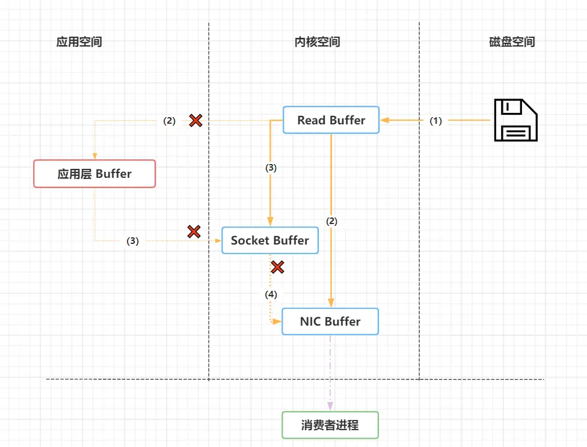

#### 基础概念
    1.Topic(话题)：Kafka中用于区分不同类别信息的类别名称。由producer指定
    2.Producer(生产者)：将消息发布到Kafka特定的Topic的对象(过程)
    3.Consumers(消费者)：订阅并处理特定的Topic中的消息的对象(过程)
    4.Broker(Kafka服务集群)：已发布的消息保存在一组服务器中, 称之为Kafka集群。集群中的每一个服务器都是一个代理(Broker). 消费者可以订阅一个或多个话题, 并从Broker拉数据, 从而消费这些已发布的消息。
    5.Partition(分区)：Topic物理上的分组, 一个topic可以分为多个partition, 每个partition是一个有序的队列。partition中的每条消息都会被分配一个有序的id（offset）
    6.Message：消息, 是通信的基本单位, 每个producer可以向一个topic（主题）发布一些消息。

#### 架构


1. Producer：Producer即生产者, 消息的产生者, 是消息的⼊口。
2. kafka cluster：kafka集群, 一台或多台服务器组成
  * Broker：Kafka 集群包含一个或多个服务器, 服务器节点称为broker。 broker存储topic的数据
  * Topic：消息的主题, 可以理解为消息的分类, kafka的数据就保存在topic。在每个broker上都可以创建多个topic。实际应用中通常是一个业务线建一个topic。
  * Partition：Topic的分区, 每个topic可以有多个分区, 分区的作用是做负载, 提高kafka的吞吐量。同一个topic在不同的分区的数据是不重复的, partition的表现形式就是一个一个的⽂件夹！
  * Replication:每一个分区都有多个副本, 副本的作用是做备胎。当主分区（Leader）故障的 时候会选择一个备胎（Follower）上位, 成为Leader。在kafka中默认副本的最大数量是10 个, 且副本的数量不能大于Broker的数量, follower和leader绝对是在不同的机器, 同一机 器对同一个分区也只可能存放一个副本（包括自己）。  
3. Consumer：消费者, 即消息的消费方, 是消息的出口。
  * Consumer Group：我们可以将多个消费组组成一个消费者组, 在kafka的设计中同一个分 区的数据只能被消费者组中的某一个消费者消费。同一个消费者组的消费者可以消费同一个 topic的不同分区的数据, 这也是为了提高kafka的吞吐量！

#### Topics和Partition
  

  topic可以理解成一个队列queue的集合, 而partiotion就是topic里面的一个个队列queue, 每个Partition在物理上对应一个文件夹, 该文件夹下存储这个Partition的所有消息和索引文件。在收到producer发送的消息
之后, kafka会均衡策略将消息存储到不同的分区partition中（每条消息都被append到该Partition中, 顺序写磁盘）。
  消息队列一般会删除已经被消费的消息, 而Kafka集群会保留所有的消息, 无论其被消费与否。当然, 因为磁盘限制, 不可能永久保留所有数据（实际上也没必要）, 因此Kafka提供两种策略删除旧数据。一是基于时间, 
二是基于Partition文件大小。其都可以通过配置文件设置。
  ```
    # 符合删除条件的日志文件的最小时间
    log.retention.hours=168
    # 日志段文件的最大大小。当达到这个大小时, 将创建一个新的日志段。
    log.segment.bytes=1073741824
    # 检查日志段的时间间隔, 以确定它们是否可以根据保留策略被删除
    log.retention.check.interval.ms=300000
    # 如果设置了log.cleaner.enable =true, 则清理器将被启用, 然后可以为日志压缩标记单个日志。
    log.cleaner.enable=false
  ```

#### Producer消息路由
  broker会根据partition的机制将producer所发送的消息存储到某一个Partition中, 若设置合理, 消息可以均匀分布到不同的Partition。
  
#### IO次数


#### Consumer Group
使用Consumer high level API时, 同一Topic的一条消息只能被同一个Consumer Group内的一个Consumer消费, 但多个Consumer Group可同时消费这一消息。
  
#### Push与Pull
 作为一个消息系统, Kafka遵循了传统的方式, 选择由Producer向broker push消息并由Consumer从broker pull消息。  

 push模式很难适应消费速率不同的消费者, 因为消息发送速率是由broker决定的。push模式的目标是尽可能以最快速度传递消息, 但是这样很容易造成Consumer来不及处理消息, 典型的表现就是拒绝服务以及网络拥塞。而pull模式则可以根据Consumer的消费能力以适当的速率消费消息。  

 Consumer可自主控制消费消息的速率, 同时Consumer可以自己控制消费方式——即可批量消费也可逐条消费, 同时还能选择不同的提交方式从而实现不同的delivery guarantee。  

#### 消息保证(delivery guarantee)
  三种消息投递语义：

    ① At most once 消息可能会丢, 但绝不会重复传递

    ② At least one  消息绝不会丢, 但可能会重复传递 (kafka默认方式)

    ③ Exactly once 每条消息肯定会被传输一次且仅传输一次, 很多时候这是用户想要的

    
  consumer在从broker读取消息后, 可以选择commit, 该操作会在Zookeeper中存下该consumer在该partition下读取的消息的offset, 该consumer下一次再读该partition时会从下一条开始读取。 
如未commit, 下一次读取的开始位置会跟上一次commit之后的开始位置相同。

  可以将consumer设置为autocommit, 即consumer一旦读到数据立即自动commit。如果只讨论这一读取消息的过程, 那Kafka是确保了Exactly once。
但实际上实际使用中consumer并非读取完数据就结束了, 而是要进行进一步处理, 而数据处理与commit的顺序在很大程度上决定了消息从broker和consumer的delivery guarantee semantic。

  读完消息先commit再处理消息。这种模式下, 如果consumer在commit后还没来得及处理消息就 panic 了, 下次重新开始工作后就无法读到刚刚已提交而未处理的消息, 这就对应于At most once。

  读完消息先处理再commit消费状态(保存offset)。这种模式下, 如果在处理完消息之后commit之前Consumer panic 了, 下次重新开始工作时还会处理刚刚未commit的消息, 实际上该消息已经被处理过了, 
这就对应于At least once。

  要做到Exactly once, 就需要协调offset和实际操作的输出, 要求与外部存储系统协作。 
  
#### 选举机制(Leader Election)
`Replica 约等于 follower`  

  1. 引入Replication之后, 同一个Partition可能会有多个Replica, 而这时需要在这些Replication之间选出一个Leader, `Producer和Consumer只与这个Leader交互`, 其它Replica作为Follower从Leader中复制数据。 
  2. 因为需要保证同一个Partition的多个Replica之间的数据一致性（其中一个宕机后其它Replica必须要能继续服务并且即不能造成数据重复也不能造成数据丢失）。如果没有一个Leader, 所有Replica都可同时读/写数据, 那就需要保证多个Replica之间互相（N×N条通路）同步数据, 数据的一致性和有序性非常难保证, 大大增加了Replication实现的复杂性, 同时也增加了出现异常的几率。而`引入Leader后, 只有Leader负责数据读写, Follower只向Leader顺序Fetch数据（N条通路）`, 系统更加简单且高效。

##### 消息传递同步策略
  1. producer首先通过Zookeeper找到partition的leader, 然后只将消息发送到leader上。
  2. leader将收到的消息写入leader本地的log中, follower从leader pull输数据。
  3. follower在收到该消息并写入其Log后, 向Leader发送ACK。
  4. 一旦Leader收到了ISR中的所有follower的ACK, 该消息就被认为已经commit了, Leader将增加HW并且向向Producer发送ACK。
  5. Consumer读消息也是从Leader读取, 只有被commit过的消息才会暴露给Consumer。

  每个Follower在接收到数据后就立马向Leader发送ACK, 而非等到数据写入Log中。因此, 对于已经commit的消息, Kafka只能保证它被存于多个Replica的内存中, 而不能保证它们被持久化到磁盘中, 也就不能完全保证异常发生后该条消息一定能被Consumer消费。
  
##### ISR(in-sync Replica)
 所有与leader副本保持一定程度同步的副本(包括leader副本在内)组成 ISR

 判断一个Broker是否“活着”包含两个条件：
  1. 必须维护与ZooKeeper的session（这个通过ZooKeeper的Heartbeat机制来实现）。 
  2. follower必须能够及时将leader的消息复制过来, 不能“落后太多”。 (最新官网文档提到replica.lag.max.messages配置参数已经移除)
     ```
     Configuration parameter replica.lag.max.messages was removed. 
     Partition leaders will no longer consider the number of lagging messages when deciding which replicas are in sync.
     ```

  leader会跟踪与其保持同步的Replica列表, 该列表称为ISR（即in-sync Replica）。如果一个follower宕机, 或者落后太多, Leader将把它从ISR中移除。只有ISR里的成员才有被选为Leader的可能。
 
##### OSR(Out-of-Sync Replied)
 leader副本同步滞后过多的副本（不包括leader副本）

##### AR
 分区中的所有副本, AR = ISR + OSR
 
##### HW、LEO、LSO


 1. HW(High Watermark): 高水位，指消费者只能拉取到这个offset之前的数据。  
 2. LEO(Log End Offset): 标识当前日志文件中下一条待写入的消息的offset，大小等于当前日志文件最后一条消息的offset+1。  
 3. LSO(LogStartOffset): 第一条开始处理的消息的offset。  
 
过程如下:
 
 
 
 

#### 零拷贝(Zero-Copy)
传统数据文件拷贝过程(经历了多次在用户态和核心态切换):
  

零拷贝:
  