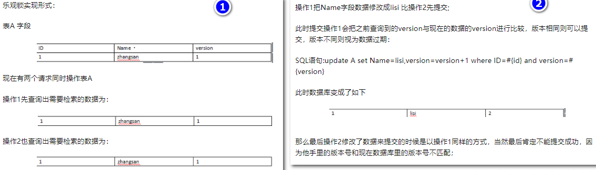

### 悲观锁
#### 定义
&ensp;&ensp;总是假设最坏的情况，每次去拿数据的时候都认为别人会修改，所以每次在拿数据的时候都会上锁，
这样别人想拿这个数据就会阻塞直到它拿到锁（共享资源每次只给一个线程使用，其它线程阻塞，用完后再把资源转让给其它线程）  
&ensp;&ensp;简单来说就是，只要是操作数据，不论是读还是写，必须先加锁再操作。
#### 特点
- 可以完全保证数据的独占性和正确性，因为每次请求都会先对数据进行加锁， 然后进行数据操作，最后再解锁
- 加锁释放锁的过程会造成消耗，所以性能不高
- 在高并发的情况下，会造成其他线程拿不到锁进而造成阻塞

### 乐观锁
#### 定义
&ensp;&ensp;总是假设最好的情况，每次去拿数据的时候都认为别人不会修改，所以不会上锁，但是在更新的时候会判断一下，
在此期间有没有别人去更新这个数据，可以使用版本号机制和CAS算法实现。乐观锁适用于多读的应用类型，这样可以提高吞吐量
&ensp;&ensp;简单来说，读取数据的时候不会受到影响，但是一旦更新数据就要去与当前的数据进行比较，再决定是否更新
#### 版本号机制

#### CAS(compare and swap)算法
CAS算法涉及到三个操作数
- 需要读写的内存值 V
- 旧的预期值 A
- 拟写入的新值 B  

当且仅当 V 的值等于 A时，CAS通过原子方式用新值B来更新V的值，否则不会执行任何操作（比较和替换是一个原子操作）。
一般情况下是一个自旋操作，即不断的重试。也就是更新一个值，但如果想改的值不再是原来的值，操作就失败，
因为很明显，有其它操作先改变了这个值